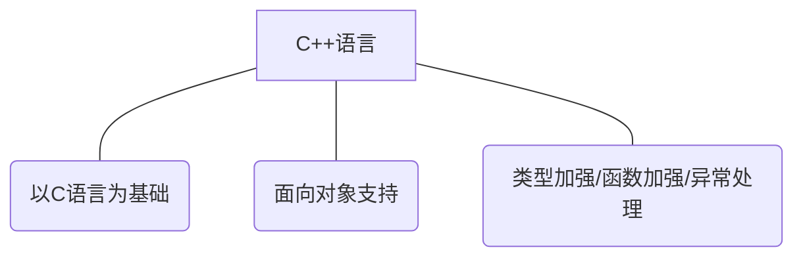
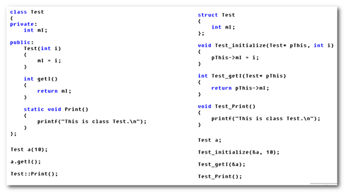
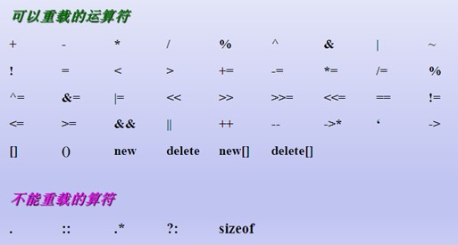
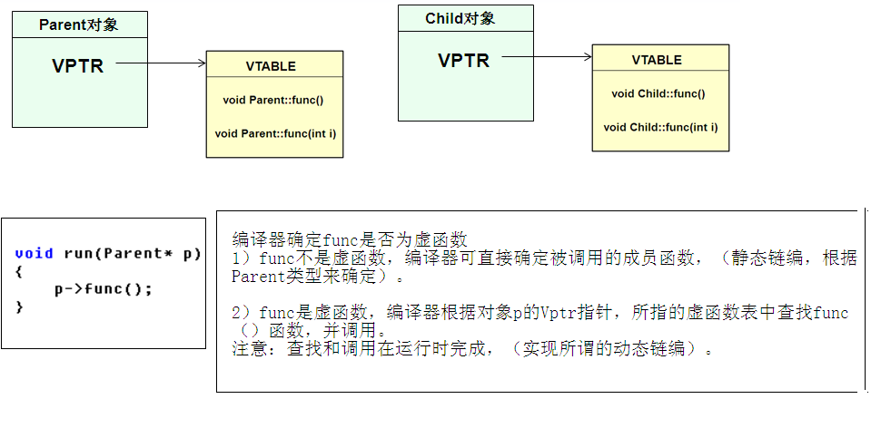
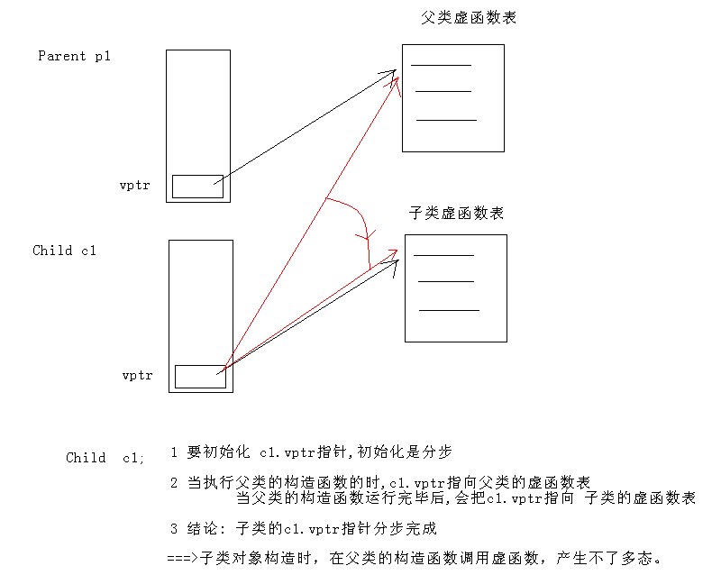

---

## C++对C的增强

 
### C++命名空间
* C中的命名空间

    - 在C语言中只有一个全局作用域

    - C语言中所有的全局标识符共享同一个作用域

    - 标识符之间可能发生冲突 

* C++中提出了命名空间的概念

    - 命名空间将全局作用域分成不同的部分

    - 不同命名空间中的标识符可以同名而不会发生冲突

    - 命名空间可以相互嵌套

    - 全局作用域也叫默认命名空间    

* 结论：

    - 当使用<iostream>的时候，该头文件没有定义全局命名空间，必须使用namespace std；这样才能正确使用cout。若不引入using namespace std;，需要这样做：std::cout;
    - C++标准为了和C区别开，也为了正确使用命名空间，规定头文件不使用后缀
    - C++命名空间的定义： namespace name{...}
    - using namespace NameSpaceA;
    - namespace 定义可以嵌套

### register关键字增强
* register关键字 请求编译器让变量a直接放在寄存器里面，速度快
* C语言中无法取得register变量地址
* 在C++中依然支持register关键字，C++编译器有自己的优化方式，不使用register也可能做优化，C++中可以取得register变量的地址
* C++编译器发现程序中需要取register变量的地址时，register对变量的声明变得无效。
* 早期C语言编译器不会对代码进行优化，因此register变量是一个很好的补充

### 变量检测增强
* 在C语言中，重复定义多个同名的全局变量是合法的

* 在C++中，不允许定义多个同名的全局变量

* C语言中多个同名的全局变量最终会被链接到全局数据区的同一个地址空间上

```C

int g_var;

int g_var = 1;

//这里有个细节，如果第一个g_var也赋值了的话，报错。。by xxq

```

* C++直接拒绝这种二义性的做法。    

### struct 类型加强
* C语言的struct定义了一组变量的集合，C编译器并不认为这是一种新的类型
* C++中的struct是一个新类型的定义声明

### C++中所有的变量和函数都必须有类型
* C++中所有的变量和函数都必须有类型，C语言中的默认类型在C++中是不合法的
* 在C语言中
    - int f(    )；表示返回值为int，接受任意参数的函数

    - int f(void)；表示返回值为int的无参函数

* 在C++中

    - int f();和int f(void)具有相同的意义，都表示返回值为int的无参函数

### 新增Bool类型关键字
* C++中的布尔类型

    - C++在C语言的基本类型系统之上增加了bool

    - C++中的bool可取的值只有true和false

    - 理论上bool只占用一个字节，

    - 如果多个bool变量定义在一起，可能会各占一个bit，这取决于编译器的实现

    - true代表真值，编译器内部用1来表示

    - false代表非真值，编译器内部用0来表示

    - bool类型只有true（非0）和false（0）两个值

    - C++编译器会在赋值时将非0值转换为true，0值转换为false


### 三目运算符
* C语言返回变量的值 C++语言是返回变量本身
    - C语言中的三目运算符返回的是变量值，不能作为左值使用
    - C++中的三目运算符可直接返回变量本身，因此可以出现在程序的任何地方    
* 注意：三目运算符可能返回的值中如果有一个是常量值，则不能作为左值使用
    - (a < b ? 1 : b )= 30;
* C语言如何支持类似C++的特性呢？
    - 当左值的条件：要有内存空间；C++编译器帮助程序员取了一个地址而已
    - 思考：如何让C中的三目运算法当左值呢？*(a < b ? &a : &b )= 30;

### C/C++中的const
* 在C中const变量会分配内存空间，是伪const
* C++编译器对const常量的处理    
    - 当碰见常量声明时，在符号表中放入常量 =è问题：那有如何解释取地址
    - 编译过程中若发现使用常量则直接以符号表中的值替换
    - 编译过程中若发现对const使用了extern或者&操作符，则给对应的常量分配存储空间（兼容C），但不会使用这个内存空间
* 结论：
    - C语言中的const变量

        - C语言中const变量是只读变量，有自己的存储空间

    - C++中的const常量

        - 可能分配存储空间,也可能不分配存储空间 

        - 当const常量为全局，并且需要在其它文件中使用

        - 当使用&操作符取const常量的地址    

* 特别注意：C++编译器虽然可能为const常量分配空间，但不会使用其存储空间中的值    

### const和#define
* const常量是由编译器处理的，提供类型检查和作用域检查
* 宏定义由预处理器处理，单纯的文本替换    

### 引用
* 普通引用在声明时必须用其它的变量进行初始化，引用作为函数参数声明时不进行初始化
* 引用的本质：
    - 引用在C++中的内部实现是一个常指针：Type& name çèType* const name
    - C++编译器在编译过程中使用常指针作为引用的内部实现，因此引用所占用的空间大小与指针相同。
    - 从使用的角度，引用会让人误会其只是一个别名，没有自己的存储空间。这是C++为了实用性而做出的细节隐藏
* 当函数返回值为引用时
    - 若返回栈变量
        - 不能成为其它引用的初始值
        - 不能作为左值使用
    - 若返回静态变量或全局变量
        - 可以成为其他引用的初始值
        - 即可作为右值使用，也可作为左值使用
* 用引用去接受函数的返回值，是不是乱码，关键是看返回的内存空间是不是被编译器回收了。。。
* 如果返回引用不是基础类型，是一个类，那么情况非常赋值。。涉及到copy构造函数和=操作重载

### const引用
* Const & int e  相当于 const int * const e
*  普通引用 相当于 int *const e1
* 当使用常量（字面量）对const引用进行初始化时，C++编译器会为常量值分配空间，并将引用名作为这段空间的别名
* 使用字面量对const引用初始化后，将生成一个只读变量

### inline内联函数
* 必须inline int myfunc(int a, int b)和函数体的实现，写在一块
* C++编译器可以将一个函数进行内联编译
    - 被C++编译器内联编译的函数叫做内联函数

    - 内联函数在最终生成的代码中是没有定义的

    - C++编译器直接将函数体插入在函数调用的地方

    - 内联函数没有普通函数调用时的额外开销(压栈，跳转，返回)
* C++编译器不一定准许函数的内联请求！
* 内联函数是一种特殊的函数，具有普通函数的特征（参数检查，返回类型等）
    - 内联函数是对编译器的一种请求，因此编译器可能拒绝这种请求

    - 内联函数由 **编译器处理**，直接将编译后的函数体插入调用的地方

    - 宏代码片段由**预处理器处理**， 进行简单的文本替换，没有任何编译过程
* 现代C++编译器能够进行编译优化，因此一些函数即使没有inline声明，也可能被编译器内联编译
    - 另外，一些现代C++编译器提供了扩展语法，能够对函数进行强制内联

    - 如：g++中的__attribute__((always_inline))属性
* C++中内联编译的限制：
    - 不能存在任何形式的循环语句   

    - 不能存在过多的条件判断语句

    - 函数体不能过于庞大

    - 不能对函数进行取址操作

    - 函数内联声明必须在调用语句之前
* 结论：
    - 内联函数在编译时直接将函数体插入函数调用的地方

    - inline只是一种请求，编译器不一定允许这种请求

    - 内联函数省去了普通函数调用时压栈，跳转和返回的开销

### 函数占位参数
* 占位参数只有参数类型声明，而没有参数名声明
* 一般情况下，在函数体内部无法使用占位参数


### 函数重载
* 编译器调用重载函数的准则

    - 将所有同名函数作为候选者

    - 尝试寻找可行的候选函数

    - 精确匹配实参

    - 通过默认参数能够匹配实参

    - 通过默认类型转换匹配实参

    - 匹配失败

    - 最终寻找到的可行候选函数不唯一，则出现二义性，编译失败。

      - 无法匹配所有候选者，函数未定义，编译失败。    
* 函数重载的注意事项

    - 重载函数在本质上是相互独立的不同函数（静态链编）

    - 重载函数的函数类型是不同的

    - 函数返回值不能作为函数重载的依据

    - 函数重载是由函数名和参数列表决定的。    
* 函数重载遇上函数指针：
    - 当使用重载函数名对函数指针进行赋值时

    - 根据重载规则挑选与函数指针参数列表一致的候选者

    - 严格匹配候选者的函数类型与函数指针的函数类型    

---

## 类和对象

### 类的封装
* 把客观事物封装成抽象的类，并且类可以把自己的数据和方法只让可信的类或者对象操作，对不可信的进行信息隐藏。
    - 有2层含义（把属性和方法进行封装 对属性和方法进行访问控制）
* struct和class关键字的区别
    - 在用struct定义类时，所有成员的默认属性为public
    - 在用class定义类时，所有成员的默认属性为private

### 构造和析构
* 有参构造函数的三种调用方法：
    - Test5 t1(10);  //c++编译器默认调用有参构造函数 **括号法**

    - Test5 t2 = (20, 10); //c++编译器默认调用有参构造函数 **等号法**

    - Test5 t3 = Test5(30); //程序员手工调用构造函数 产生了一个对象 **直接调用构造构造函数法**
* 拷贝构造函数的四种调用场景：
    - 初始化操作（直接初始化和等号初始化）

    -  赋值操作

    -  传递给函数参数

    - 函数返回匿名对象    

### 匿名对象的去和留
* 如果用匿名对象 **初始化** 另外一个同类型的对象，匿名对象转成有名对象，不被析构

* 如果用匿名对象 **赋值给**另外一个同类型的对象，匿名对象被析构


### 默认构造函数
* 1）默认无参构造函数
    - 当类中没有定义构造函数时，编译器默认提供一个无参构造函数，并且其函数体为空
* 2）默认拷贝构造函数
    - 当类中没有定义拷贝构造函数时，编译器默认提供一个默认拷贝构造函数，简单的进行成员变量的值复制

### 构造函数调用规则研究
* 1）当类中没有定义任何一个构造函数时，c++编译器会提供默认无参构造函数和默认拷贝构造函数

* 2）当类中定义了拷贝构造函数时，c++编译器不会提供无参数构造函数

* 3） 当类中定义了任意的非拷贝构造函数（即：当类中提供了有参构造函数或无参构造函数），c++编译器不会提供默认无参构造函数

* 4 ）默认拷贝构造函数成员变量简单赋值

* 总结：只要你写了构造函数，那么你必须用。    

### 深拷贝和浅拷贝
* 默认复制构造函数可以完成对象的数据成员值简单的复制
* 对象的数据资源是由指针指示的堆时，默认复制构造函数仅作指针值复制

### 对象初始化列表
* 对象初始化列表出现原因
    - 1.必须这样做：

        - 如果我们有一个类成员，它本身是一个类或者是一个结构，而且这个成员它只有一个带参数的构造函数，没有默认构造函数。这时要对这个类成员进行初始化，就必须调用这个类成员的带参数的构造函数，如果没有初始化列表，那么他将无法完成第一步，就会报错。

 

    - 2、类成员中若有const修饰，必须在对象初始化的时候，给const int m 赋值

        - 当类成员中含有一个const对象时，或者是一个引用时，他们也必须要通过成员初始化列表进行初始化，因为这两种对象要在声明后马上初始化，而在构造函数中，做的是对他们的赋值，这样是不被允许的。    

* 成员变量的初始化顺序与声明的顺序相关，与在初始化列表中的顺序无关，初始化列表先于构造函数的函数体执行
* **初始化**：被初始化的对象正在创建，**赋值**：被赋值的对象已经存在

### 构造函数和析构函数的调用顺序
* 1）当类中有成员变量是其它类的对象时，首先调用成员变量的构造函数，调用顺序与声明顺序相同；之后调用自身类的构造函数
* 2）析构函数的调用顺序与对应的构造函数调用顺序相反

### 对象的动态建立和释放
* new/delete 和malloc/free
    - new和delete是运算符，不是函数，因此执行效率高
    - malloc不会调用类的构造函数，Free不会调用类的析构函数
* new [], delete []配对

### 静态成员变量
* 关键字 static 可以用于说明一个类的成员，静态成员提供了一个同类对象的共享机制
* 把一个类的成员说明为 static 时，这个类无论有多少个对象被创建，这些对象共享这个 static 成员
* 静态成员局部于类，它不是对象成员
* 必须在类外初始化静态成员变量，要告诉编译器要分配内存

### 静态成员函数
* 概念：
    - 静态成员函数数冠以关键字static 
    -  静态成员函数提供不依赖于类数据结构的共同操作，它**没有this指针**
    - 在类外调用静态成员函数用 “类名 :: ”作限定词，或通过对象调用    
* 疑难问题：静态成员函数中，不能使用普通变量

---

## C++面向对象模型初探

### 前言
* C++对象模型可以概括为以下2部分：

    - 1. 语言中直接支持面向对象程序设计的部分，主要涉及如构造函数、析构函数、虚函数、继承（单继承、多继承、虚继承）、多态等等。

    - 2. 对于各种支持的底层实现机制。

* 在c语言中，“数据”和“处理数据的操作（函数）”是分开来声明的，也就是说，语言本身并没有支持“数据和函数”之间的关联性。在c++中，通过抽象数据类型（abstract data type，ADT），在类中定义数据和函数，来实现数据和函数直接的绑定。

* 概括来说，在C++类中有两种成员数据：static、nonstatic；三种成员函数：static、nonstatic、virtual。    


### 编译器对属性和方法的处理机制
* 1）C++类对象中的成员变量和成员函数是分开存储的

    - 成员变量：

        - 普通成员变量：存储于对象中，与struct变量有相同的内存布局和字节对齐方式

        - 静态成员变量：存储于全局数据区中

    - 成员函数：存储于代码段中。

    - 问题出来了：很多对象共用一块代码？代码是如何区分具体对象的那？

* 2）C++编译器对普通成员函数的内部处理
    * 

* 总结：
- 1、C++类对象中的成员变量和成员函数是分开存储的。C语言中的内存四区模型仍然有效！

- 2、C++中类的普通成员函数都隐式包含一个指向当前对象的this指针。

- 3、静态成员函数、成员变量属于类

    - 静态成员函数与普通成员函数的区别  

        - 静态成员函数不包含指向具体对象的指针    

        - 普通成员函数包含一个指向具体对象的指针    

* 类的成员函数可通过const修饰，请问const修饰的是谁，const修饰的是this指针

---

## 友元

### 友元函数

####友元类
* 若B类是A类的友员类，则B类的所有成员函数都是A类的友员函数
* 友员类通常设计为一种对数据操作或类之间传递消息的辅助类    

---

## 运算符重载

### 运算符重载的限制
* 
* 不改变运算符的优先级
* 不改变运算符的结合性
* 不改变运算符所需要的操作数
* 不能创建新的运算符

### 运算符重载的两种方法：
* 运算符函数可以重载成为**成员函数**或**友元函数**
* 关键区别在于成员函数具有this指针，友元函数没有this指针
* 传递参数的方式不同，实现代码不同，应用场合也不同
* 前置++/--和后置++/--:
    - 前置：前置—操作符 成员函数实现：Complex& operator--()
    - 后置：后置— 操作符 用类成员函数实现：Complex operator--(int)
* C++中通过一个占位参数来区分前置运算和后置运算

### 友元函数实现操作符重载的应用场景
* 友元函数和成员函数选择方法  
    - 当无法修改左操作数的类时，使用全局函数进行重载
    - =, [], ()和->操作符只能通过成员函数进行重载
* 用友元函数 重载 << >>操作符
    -  istream 和 ostream 是 C++ 的预定义流类
    - cin 是 istream 的对象，cout 是 ostream 的对象
    - 运算符 << 由ostream 重载为插入操作，用于输出基本类型数据
    - 运算符 >> 由 istream 重载为提取操作，用于输入基本类型数据
    - 用友员函数重载 << 和 >> ，输出和输入用户自定义的数据类型
    - 类成员函数方法无法实现 << 操作符重载
    - C++中不能用友员函数重载的运算符有：=    （）    ［］    －>

### 为什么不用重载&&和||操作符
*  1）&&和||是C++中非常特殊的操作符
    - 2）&&和||内置实现了短路规则
    - 3）操作符重载是靠函数重载来完成的    
    - 4）操作数作为函数参数传递
    - 5）C++的函数参数都会被求值，无法实现短路规则    

### 总结
* 操作符重载是C++的强大特性之一
* 操作符重载的本质是通过函数扩展操作符的语义
* operator关键字是操作符重载的关键
* friend关键字可以对函数或类开发访问权限
* 操作符重载遵循函数重载的规则
* 操作符重载可以直接使用类的成员函数实现
* =, [], ()和->操作符只能通过成员函数进行重载
* ++操作符通过一个int参数进行前置与后置的重载
* C++中不要重载&&和||操作符    

---

## 继承和派生

### 不同的继承方式会改变继承成员的访问属性
* C++中的继承方式会影响子类的对外访问属性

    - public继承：父类成员在子类中保持原有访问级别

    - private继承：父类成员在子类中变为private成员

    - protected继承：

        - 父类中public成员会变成protected

        - 父类中protected成员仍然为protected

        - 父类中private成员仍然为private    

* private成员在子类中依然存在，但是却无法访问到。不论种方式继承基类，派生类都不能直接使用基类的私有成员。


### 继承中的对象模型
* 类在C++编译器的内部可以理解为结构体
* 子类是由父类成员叠加子类新成员得到的    
* 类型兼容性原则：
    - 子类对象可以当作父类对象使用

    - 子类对象可以直接赋值给父类对象

    - 子类对象可以直接初始化父类对象

    - 父类指针可以直接指向子类对象

    - 父类引用可以直接引用子类对象    

* 如何初始化父类成员？父类与子类的构造函数有什么关系
    - 在子类对象构造时，需要调用父类构造函数对其继承得来的成员进行初始化

    - 在子类对象析构时，需要调用父类析构函数对其继承得来的成员进行清理    


### 继承中的构造和析构调用原则
* 1、子类对象在创建时会首先调用父类的构造函数
* 2、父类构造函数执行结束后，执行子类的构造函数
* 3、当父类的构造函数有参数时，需要在子类的初始化列表中显示调用
* 4、析构函数调用的先后顺序与构造函数相反

### 继承和组合混搭情况下，构造和析构调用原则
* 先构造父类，再构造成员变量、最后构造自己

* 先析构自己，在析构成员变量、最后析构父类


### 继承中的同名成员变量处理方法
* 1、当子类成员变量与父类成员变量同名时
* 2、子类依然从父类继承同名成员
* 3、在子类中通过作用域分辨符::进行同名成员区分（在派生类中使用基类的同名成员，显式地使用类名限定符）
* 4、同名成员存储在内存中的不同位置    

### 派生类中的static关键字
*  基类定义的静态成员，将被所有派生类共享
* 根据静态成员自身的访问特性和派生类的继承方式，在类层次体系中具有不同的访问性质 （遵守派生类的访问控制）
* 总结：

    - 1> static函数也遵守3个访问原则

    - 2> static易犯错误（不但要初始化，更重要的显示的告诉编译器分配内存）

    - 3> 构造函数默认为private

---

## 多继承
*  一个类有多个直接基类的继承关系称为多继承
* 多继承声明语法
``` C
class  派生类名 : 访问控制基类名1 ,  访问控制基类名2 ,  … , 访问控制基类名n
{
    数据成员和成员函数声明
};
```

* 类 C 可以根据访问控制同时继承类 A 和类 B 的成员，并添加    


### 多继承的派生类构造和访问

* 多个基类的派生类构造函数可以用初始式调用基类构造函数初始化数据成员

* 执行顺序与单继承构造函数情况类似。多个直接基类构造函数执行顺序取决于定义派生类时指定的各个继承基类的顺序。

* 一个派生类对象拥有多个直接或间接基类的成员。不同名成员访问不会出现二义性。如果不同的基类有同名成员，派生类对象访问时应该加以识别。    

### 虚继承
*  如果一个派生类从多个基类派生，而这些基类又有一个共同的基类，则在对该基类中声明的名字进行访问时，可能产生二义性 
* 如果一个派生类从多个基类派生，而这些基类又有一个共同的基类，则在对该基类中声明的名字进行访问时，可能产生二义性
* 如果在多条继承路径上有一个公共的基类，那么在继承路径的某处汇合点，这个公共基类就会在派生类的对象中产生多个基类子对象
* 要使这个公共基类在派生类中只产生一个子对象，必须对这个基类声明为虚继承，使这个基类成为虚基类。
* 虚继承声明使用关键字           virtual
* 注意增加virtual关键字后，构造函数调用的次数

### 继承总结
* 继承是面向对象程序设计实现软件重用的重要方法。程序员可以在已有基类的基础上定义新的派生类。
* 单继承的派生类只有一个基类。多继承的派生类有多个基类。
* 派生类对基类成员的访问由继承方式和成员性质决定。
* 创建派生类对象时，先调用基类构造函数初始化派生类中的基类成员。调用析构函数的次序和调用构造函数的次序相反。
* C++提供虚继承机制，防止类继承关系中成员访问的二义性。
* 多继承提供了软件重用的强大功能，也增加了程序的复杂性。    

---

## 多态
* 如果子类定义了与父类中原型相同的函数会发生什么？
    - 函数重写
    - 在子类中定义与父类中原型相同的函数
    - 函数重写只发生在父类与子类之间
    - 父类中被重写的函数依然会继承给子类

    - 默认情况下子类中重写的函数将隐藏父类中的函数

    - 通过作用域分辨符::可以访问到父类中被隐藏的函数    

### 多态成立的三个条件
* 1 要有继承

* 2 要有virtual函数重写。。。C 虚函数

* 3 要有父类指针（父类引用）指向子类对象

* 多态是设计模式的基础，多态是框架的基础 

### 静态联编和动态联编
* 1、联编是指一个程序模块、代码之间互相关联的过程。

* 2、静态联编（static binding），是程序的匹配、连接在编译阶段实现，也称为早期匹配。

    - 重载函数使用静态联编。

* 3、动态联编是指程序联编推迟到运行时进行，所以又称为晚期联编（迟绑定）。

    - switch 语句和 if 语句是动态联编的例子。

* 4、理论联系实际


### 重写和重载
* 函数重载

    - 必须在同一个类中进行

    - 子类无法重载父类的函数，父类同名函数将被名称覆盖

    - 重载是在编译期间根据参数类型和个数决定函数调用

* 函数重写

    - 必须发生于父类与子类之间

    - 并且父类与子类中的函数必须有完全相同的原型

    - 使用virtual声明之后能够产生多态(如果不使用virtual，那叫重定义)

* 多态是在运行期间根据具体对象的类型决定函数调用

* 当父类和子类有相同的函数名、变量名出现，发生**名称覆盖**（子类的函数名，覆盖了父类的函数名。）
``` C++
class Father{
public:
    void hi() { cout << "father" << endl; }
};
class Child : public Father {
public:
    void hi(int i) { cout << "child" << endl; }
};
int main()
{
    Child c;
    c.hi(); // 这里会报错
} 
```

### 虚函数表指针（VPTR）被编译器初始化的过程
* 构造父类的时候指向父类的虚函数表
* 构造子类的时候指向子类的虚函数表
* 父类的构造函数中调用虚函数，能发生多态吗？显然不能

### 虚析构函数
* 构造函数不能是虚函数。建立一个派生类对象时，必须从类层次的根开始，沿着继承路径逐个调用基类的构造函数
* 析构函数可以是虚的。虚析构函数用于指引 delete 运算符正确析构动态对象    

### 父类指针和子类指针的步长
* 1）  铁律1：指针也只一种数据类型，C++类对象的指针p++/--，仍然可用。

* 2）  指针运算是按照指针所指的类型进行的。

    - p++《=》p=p+1 //p = (unsigned int)basep + sizeof(*p) 步长。

* 3）  结论：父类p++与子类p++步长不同；不要混搭，不要用父类指针++方式操作数组。


### 多态原理探究
*  当类中声明虚函数时，编译器会在类中生成一个虚函数表
* 虚函数表是一个存储类成员函数指针的数据结构
* 虚函数表是由编译器自动生成与维护的
* virtual成员函数会被编译器放入虚函数表中
* 当存在虚函数时，每个对象中都有一个指向虚函数表的指针（C++编译器给父类对象、子类对象提前布局vptr指针；当进行howToPrint(Parent *base)函数是，C++编译器不需要区分子类对象或者父类对象，只需要再base指针中，找vptr指针即可。）
* VPTR一般作为类对象的第一个成员
    * 
 
* 说明1：

    - 通过虚函数表指针VPTR调用重写函数是在程序运行时进行的，因此需要通过寻址操作才能确定真正应该调用的函数。而普通成员函数是在编译时就确定了调用的函数。在效率上，虚函数的效率要低很多。

* 说明2：

    - 出于效率考虑，没有必要将所有成员函数都声明为虚函数    

### 构造函数中能调用虚函数，实现多态吗？
* 对象中的VPTR指针什么时候被初始化？                                 

* 对象在创建的时,由编译器对VPTR指针进行初始化

* 只有当对象的构造完全结束后VPTR的指向才最终确定

* 父类对象的VPTR指向父类虚函数表

* 子类对象的VPTR指向子类虚函数表   

*  
 
---

## 纯虚函数和抽象类

* C++中没有Java中的接口概念，抽象类可以模拟Java中的接口类。（接口和协议）
* 绝大多数面向对象语言都不支持多继承
* 绝大多数面向对象语言都支持接口的概念
* C++中没有接口的概念
* C++中可以使用纯虚函数实现接口
* 接口类中只有函数原型定义，没有任何数据的定义。
``` C++
class Interface 
{

public:
    virtual void func1() = 0;
    virtual void func2(int i) = 0;
    virtual void func3(int i) = 0;
};
```

### 几种重要的面向对象思想
* 继承-组合（强弱）
* 注入
* 控制反转 IOC
* MVC
* 面向对象思想扩展aop思想，aop思想是对继承编程思想的有力的补充

### 面向接口编程和C多态
* 函数指针做函数参数
* 回调函数
