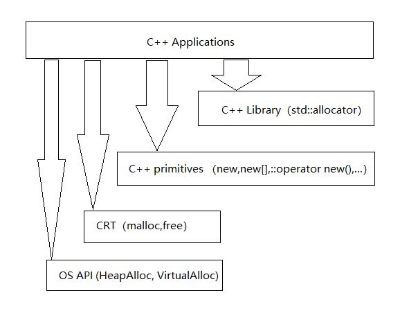

* c++ 应用程序处理内存的接口之间的关系
  - c++ Library: std::allocator
  - c++ primitives: new, new[], new(), ::operator new(), ...
  - CRT: malloc, free
  - OS API: HeapAlloc, VirtualAlloc, ...


* c++ memory primitives

| 分配            |  释放         |   类别      |   可否重载   |
| :-------------  | :--------    |  :--------- | :---------- |
|    malloc()     | free()       | C函数       |  不可        |
| new             | delete       | C++表达式   |  不可        |
|::operator new() | ::operator delete() | C++函数 | 可        |
| allocator\<T>::allocate() | allocator<T>::deallocate() | C++标准库 | 可自由设计并搭配任何容器 |

* c++ memory primitives 示例
``` c++
void* p1 = malloc(512);
free(p1);

complex<int>* p2 = new complex<int>;
delete p2;

void* p3 = ::operator new(512);
::operator delete(p3);

#ifdef _MS_VER
// 以下两个函数都是non-static，要通过object调用，以下分配3个ints
int* p4 = allocator<int>().allocate(3, (int*)0);
allocator<int>().deallocate(p4, 3);
#endif
#ifdef __GNUC__
// 以下两个函数是static，可以通过全名调用，以下分配512 bytes.
void* p4 = alloc::allocate(512);
alloc::deallocate(p4, 512);
#endif
```

* new expression
``` c++
Complex* pc = new Complex(1, 2);
// 编译器转为等价于以下代码
Complex *pc;
try {
  void* mem = operator new(sizeof(Complex)); // 底层调用malloc
  pc = static_cast<Complex*>(mem);
  pc->Complex::Complex(1, 2); // 只有编译其可以这么调用
  // 欲直接调用ctor，可用 placement new: new(p) Complex(1, 2);
}
catch (std::bad_alloc) {
  // 若 allocation 失败就不执行constructor
}
```

* delete expression
``` c++
delete pc;
// 编译器转为等价于以下代码
pc->~Complex();
operator delete(pc);
```

* array new, array delete
  - 如果用array new 但是用 delete 只会调用一次dtor，如果对象带指针，可能会有内存泄漏
  - 内存泄漏的不是array本身，而是对象内指针指向的内存
  - new 在内存中的情况
  
  

* placement new
  - 允许我们将object构造在allocated memory中
  - 没有所谓placement delete，因为placement new根本没分配memory
``` c++
char* buf = new char[sizeof(Complex) * 3];
Complex* pc = new (buf) Complex(1, 2);
...
delete [] buf;
```

* 重载operator new / operator delete
  - 一般不重载global的，而是在class内重载
  - 如果使用 ::new 和 ::delete 则会使用global的方法，而不用重载的方法
  - 重载可以写多个版本，其中第一个参数必须是 `size_t`, 其余参数是以 placement new 的参数传递过来
  - 当ctor抛出异常，对应的 `operator (placement) delete` 会被调用（有些编译器会不调用！）
``` c++
class Foo {
public:
  // operator new 的重载
  static void* operator new(size_t size); // Foo* p1 = new Foo;
  // placement new 的重载
  static void* operator new(size_t size, void* start) { return start; } // Foo* p2 = new (&start) Foo;
  static void* operator new(size_t size, long extra) { return malloc(size+extra); } // Foo* p3 = new (100) Foo;
  static void* operator new(size_t size, long extra, char init) { return malloc(size+extra); } // Foo* p4 = new(100, 'a') Foo;

  static void operator delete(void* pdead, size_t size);
  static void* operator new[](size_t size);
  static void operator delete[](void *pdead, size_t size);
};

Foo* p = new Foo(7);
delete p;
Foo* pArray = new Foo(5);
delete [] pArray;
```

