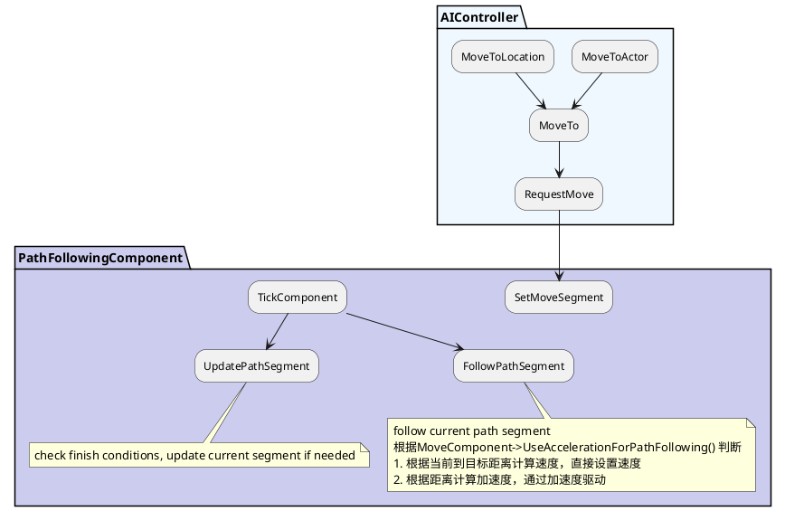
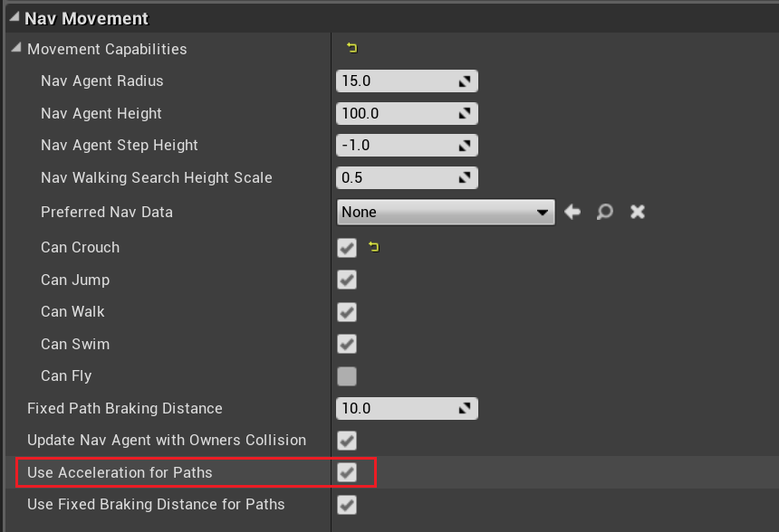

* 使用`AIController.MoveToActor/MoveToLocation`来驱使AI角色移动

``` plantuml
@startuml
Partition AIController #AliceBlue {
    "MoveToActor" --> "MoveTo"
    "MoveToLocation" --> "MoveTo"
    "MoveTo" --> "RequestMove"
}


Partition PathFollowingComponent #CCCCEE {
    "RequestMove" --> "SetMoveSegment"
    "TickComponent" --> "UpdatePathSegment"
    note bottom: check finish conditions, update current segment if needed
    "TickComponent" --> "FollowPathSegment"
    note bottom
        follow current path segment 
        根据MoveComponent->UseAccelerationForPathFollowing() 判断
        1. 根据当前到目标距离计算速度，直接设置速度
        2. 根据距离计算加速度，通过加速度驱动
    end note
}
@enduml
```
* `NavMovementComponent`中可以设置速度还是加速度的模式
