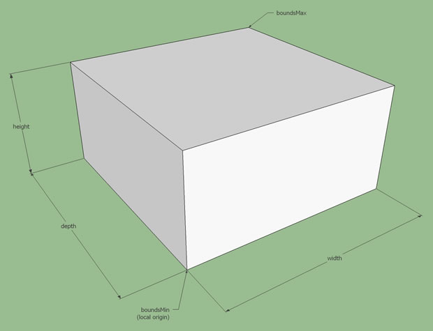
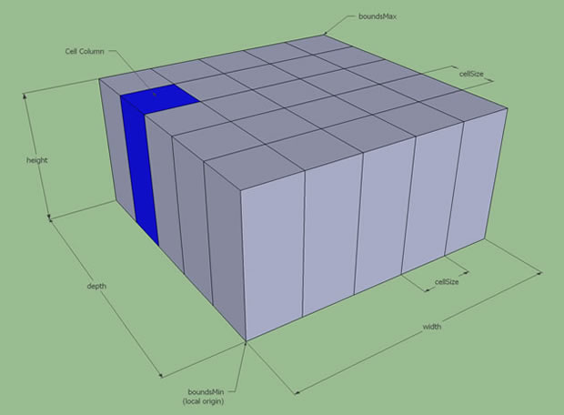
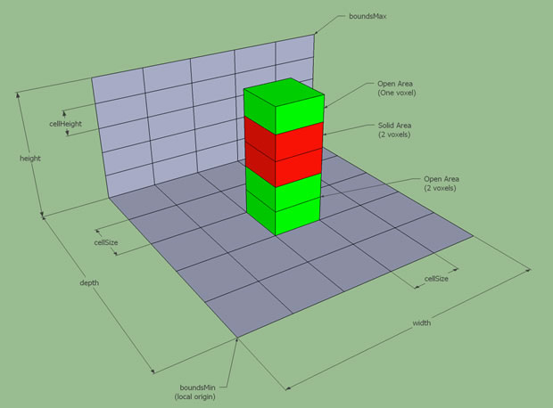
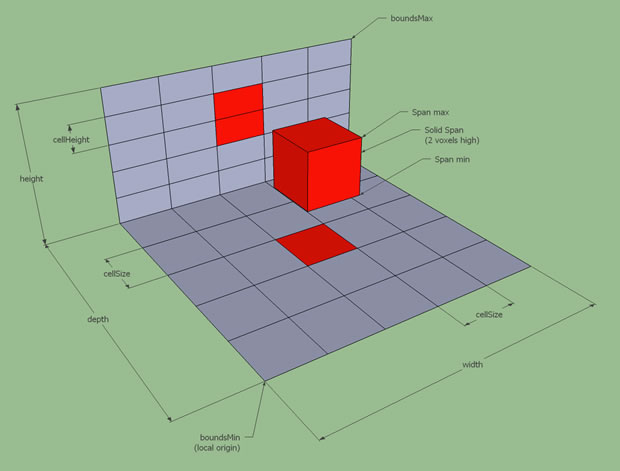
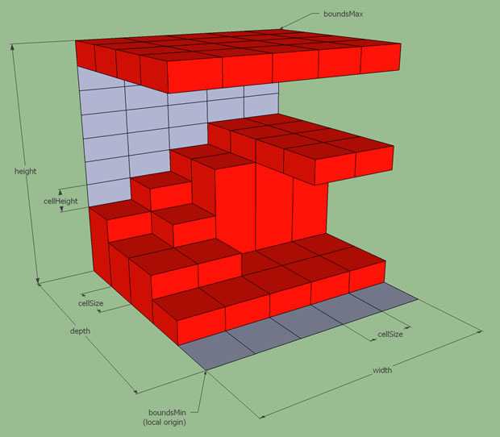
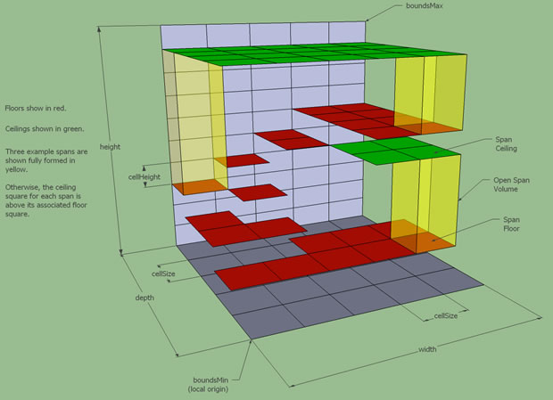
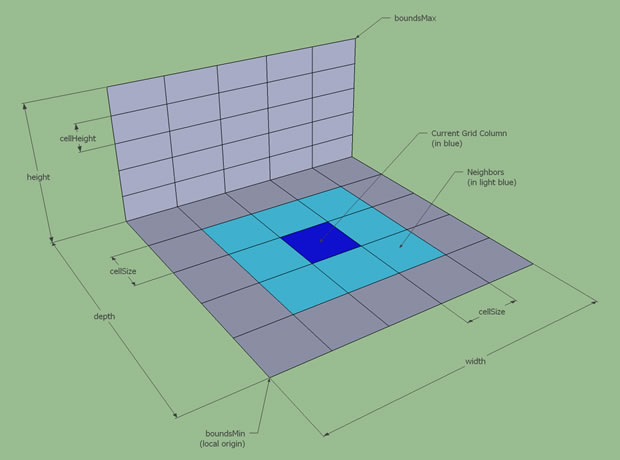
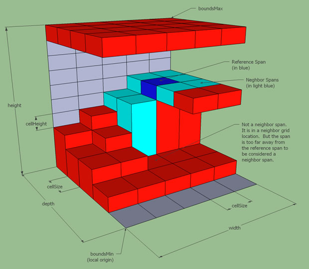
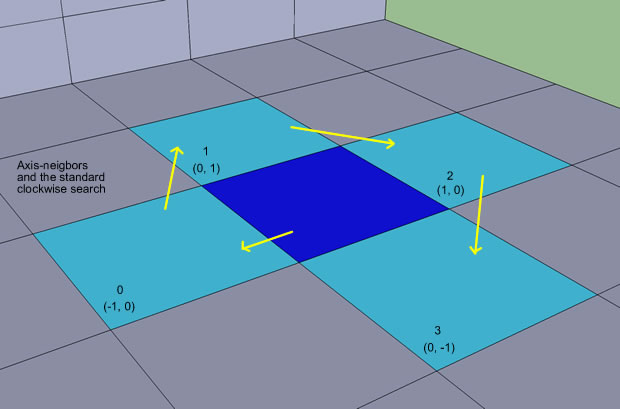
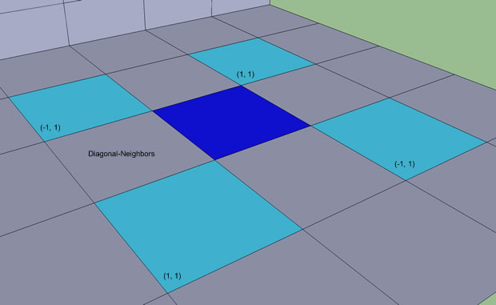

---
html:
    toc:true:
---
<!-- @import "[TOC]" {cmd="toc" depthFrom=2 depthTo=6 orderedList=false} -->

<!-- code_chunk_output -->

- [Basic Heightfield Structure](#basic-heightfield-structure)
- [Height Spans](#height-spans)
    - [The Standard Solid Span](#the-standard-solid-span)
    - [The Special Open Span](#the-special-open-span)
- [Putting the Basics Together](#putting-the-basics-together)
- [Miscellany](#miscellany)
    - [Searching the Neighborhood](#searching-the-neighborhood)

<!-- /code_chunk_output -->

# Introduction to Heightfields
In order to understand the process NMGen uses to generate data used for navigation meshes, it is important to first understand how it uses heightfields to represent voxel data. Heightfields provide good compression and a data structure that is particularly useful for extracting the upper surface information from geometry.

## Basic Heightfield Structure
Consider an axis-aligned box at an arbitrary location in euclidian space. Its bounds are defined by a minimum and maximum vertex.

Now slice the box into vertical columns of identical width and depth. The columns make up a grid.

Now slice the columns in uniform increments up the height axis, breaking the columns into small axis-aligned boxes. This structure is a good representation of voxel space.

## Height Spans
#### The Standard Solid Span
Consider a column of voxels. The area defined by each voxel is either solid, representing obstructed space, or open, representing space that does not contain any obstructions.

In general, we only care about the solid area of a heightfield. So we merge the contiguous solid voxels within the column and we get a span of solid voxels, making the structure much simpler. This is a "heightspan", or "span" for short.

We get a solid heightfield by putting spans into the heightfield structure. This is a representation of the obstructed area of the field.

#### The Special Open Span
We don't only care about solid space. Many algorithms operate on the space above solid spans. For navigation mesh generation this is the most important part of solid space, its upper surface. Open height spans are used to represent this space.

It is important to note that this is not a simple inversion of the solid space. If a heightfield column does not contain any solid spans, it doesn't have any open spans. The area below the lowest solid span is also ignored. Only the space above existing solid spans is represented by open spans.

For this reason, open spans use the nomenclature of "floor" and "ceiling". The floor of an open span is the top (maximum) of its associated solid span. The ceiling of an open span is the bottom (minimum) of the next higher solid span in its column. If there are no higher solid spans, then the ceiling of the open span is an arbitrary maximum, such as the maximum value for an integer.

> Though it may not be obvious at first glance, this example is the open space representation of the previous example. Three open spans are fully visualized.

## Putting the Basics Together
We now have all of the structural pieces we need to to represent voxel information in a heightfield.
1. An axis-aligned bounding box with position in euclidean space.
2. Width, depth, and height resolution information.
3. A grid of columns in which to store span information.
4. Spans which represent either contiguous solid space or contiguous open space above solid space.

> The meaning of "cellHeight" is a little ambiguous. It represents the height increment/resolution within cell columns. It does not represent the height of the cell columns.
> "Grid location", "cell", and "cell column" are synonymous

## Miscellany
#### Searching the Neighborhood
The heightfields implemented by NMGen provide operations that make it easy to iterate through all spans and spans within a column. But algorithms often need to perform neighbor searches.

Cell columns have neighbors...

And spans can have neighbors. Though span neighbors are only considered neighbors if they are close enough in height to the reference span. Only the open heightfield implementation provides a means to search for neighbor spans....

Neighbors are referred to by their offset from the reference column or span. E.g. (referenceWidthIndex+widthOffset, referenceDepthIndex+depthOffset)

Axis-neighbors are the four neighbors offset along the width/depth axes: (-1, 0) (0, 1) (1, 0) (0, -1)

Axis-neighbor searches are performed in a standard manner for all heightfield implementations, starting at (0, -1) and proceeding in a clockwise direction using standard indices.

Index | Neighbor Offset
------|----------------
0 | (-1, 0)
1 | (0, 1)
2 | (1, 0)
3 | (0, -1)

Diagonal-neighbors are the four neighbors offset along the diagonal axes: (-1, 1) (1, 1) (1, -1) (-1, -1).

There are no standard search indices for diagonal neighbors. Instead, the usual practice is to search clockwise of the axis neighbor for its corresponding diagonal neighbor.

