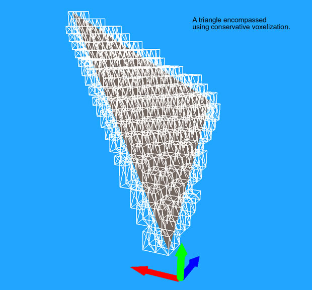
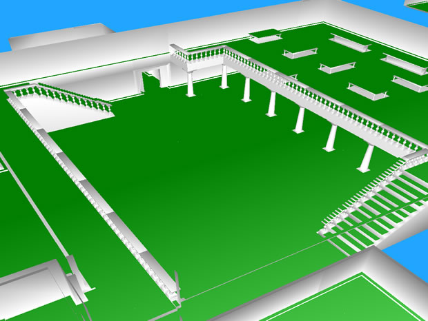
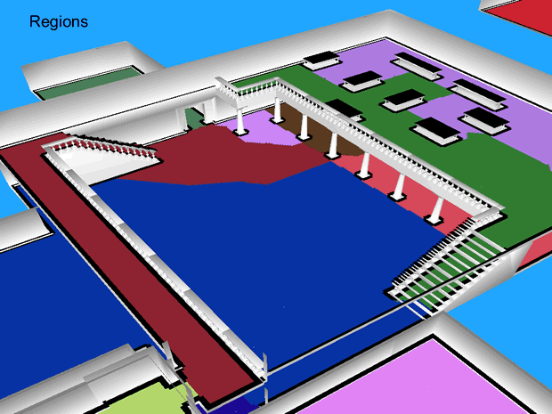
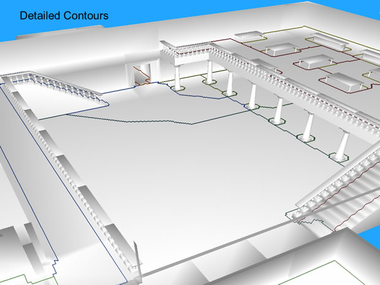
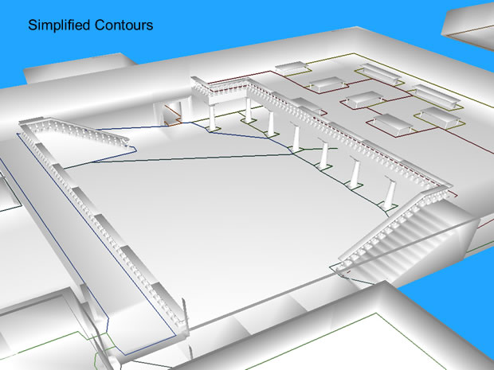
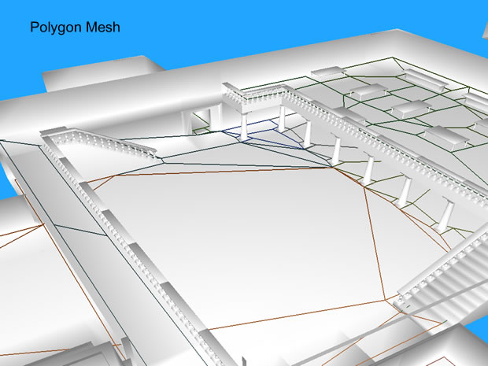
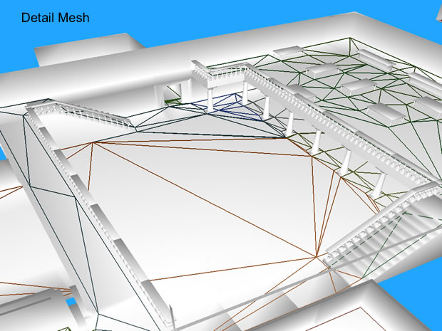

# The High Level Process
This page describes the high level process used by NMGen to create navigation mesh data. The process is implemented by the NavmeshGenerator class.

> If you haven't done so already, I highly recommend watching the Recast demonstration video at AIGameDev.com.

> In the presentation Alex mentions the release of Recast as being in the future. The open source release has occurred since the video was recorded. Recast is up to v1.4 as of the writing of this page.

The general process is as follows:
1. Voxelization - Create a solid heightfield from the source geometry.
2. Generate Regions - Detect the top surface area of the solid heightfield and divide it up into regions of contiguous spans.
3. Generate Contours - Detect the contours of the regions and form them into simple polygons.
4. Generate Polygon Mesh - Sub-divide the contours into convex polygons.
5. Generate Detailed Mesh - Triangulate the polygon mesh and add height detail.

> The use of the data created by NMGen is beyond the scope of this study. But Detour, a sister library of Recast, is a good example of how to use these data structures for pathfinding and spatial reasoning. It is available at the Recast site.

## Voxelization
Implemented by the SolidHeightfieldBuilder class.

During voxelization the source geometry is abstracted into a heightfield that represents obstructed space. Then some initial culling of un-walkable surfaces is performed.

Each triangle in the source geometry is voxelized using conservative voxelization and added to the field. Conservative voxelization is an algorithm that ensures the polygon surfaces are completely encompassed by the the generated voxels.

Follows is an example of a triangle that has been encompassed using conservative triangulation:

After voxelization, the solid heightfield contains spans that completely encompass the surface of all polygons in the source geometry.

Once voxelization is complete, these spans are marked as traversable if they pass the following tests:

* The top of the span is at least a minimum distance from the bottom of the span above it. (The tallest agent can stand on the span without colliding with an obstruction above.)
* The top voxel of the span represents geometry with a slope below a maximum allowed value. (The slope is low enough to be traversable by agents.)
* If ledge culling is enabled, the top of the span does not represent a ledge. (Agents can legally "step down" from the span to all of its neighbors.)

## Region Generation
Implemented by the OpenHeightfieldBuilder class.

The goal of this stage is to further define what portion of the solid surface is traversable, and to segregate the traversable areas into contiguous regions of spans (surfaces) that can eventually be formed into simple polygons.

The first step is to translate the solid heightfield into an open heightfield which represents the potential traversable surfaces on top of the solid space. An open heightfield represents the potential floor area on the surface of solid space.

In the below example, the green area represents the floor defined by the open spans. These correspond to the top of all traversable spans in the solid heightfield. Note that walls, areas under the tables, and some thin areas such as the balcony banisters were culled during the solid heightfield generation process. Some un-walkable areas such as table tops, the stair banisters, and thin wall ledges still show as traversable at this point.

Next, further culling of un-walkable spans occurs. At the end of the process, open spans are only considered traversable if they pass the following tests:

* The span is not too close to an obstruction. (Such as walls, furniture, etc.)
* The span has sufficient unobstructed space above its floor. (Agents can legally walk on the span without colliding with objects above the span.)

Neighbor information is generated for all surviving open spans to help group spans together into true surface areas. The algorithm takes into account a maximum vertical step threshold to determine which spans can connect. This permits structures such as stairs, curbs, table tops, etc. to be properly taken into account. For example, spans that make up different steps in a stairway will be connected as neighbors. But spans on a table top will not be connected to spans that make up the adjacent floor.

Regions are generated using the neighbor information and the watershed algorithm. Region size is optimized and island regions too small to be of use (e.g. table tops) are culled.

The below example shows regions. Note that regions flow up the stairs, even though the spans that make up stairways don't actually connect. Also note that the table tops, stair banisters, and all other un-walkable surfaces that made it through the solid heightfield generation process have been successfully culled. (Black indicates culled spans.)

At the end of this stage, the traversable surface is represented by regions of connected spans.

## Contour Generation
Implemented by the ContourSetBuilder class

The contours of the regions are "walked", forming simple polygons. This is the first step in the process of moving from voxel space back into vector space.

First, highly detailed polygons are generated from the regions.

Next, various algorithms are used to accomplish the following:

* Simplify the edges between adjacent polygons. (The portals between regions.)
* Ensure that border edges conform to the borders of traversable surfaces. (Border edges are the contour edges that connect to empty or obstructed space.)
* Optimize the length of the border edges. (Borders that are too long can form non-optimal triangles later in the process.)

This next example shows the contours after these algorithms have been run.

At the end of this stage, the traversable surface is represented by simple polygons.

## Convex Polygon Generation
mplemented by the PolyMeshBuilder class

Many algorithms can only be used with convex polygons. So this step subdivides the simple polygons that make up the contours into a mesh of convex polygons.

This is accomplished by using a triangulation suitable for simple polygons, then merging triangles into the largest possible convex polygons. 

> The PolyMeshBuilder class implements a configuration parameter (maxVertsPerPoly) that can restrict output to triangles.

Below you can see that a mixture of concave polygons have been formed from the contours.

At the end of this stage, the traversable surface is represented by a mesh of convex polygons.

## Detailed Mesh Generation
Implemented by the DetailMeshBuilder class.

In the final stage, the convex polygon mesh is triangulated using Delaunay triangulation so that height detail can be added. Vertices are added internally and to the edges of polygons to ensure the original geometry's surface is adequately followed.

> The detail mesh generated in this stage can be used as the primary navigation mesh in simple navigation systems. But there are ways of combining the data from the various stages for use in navigation decisions. Detour, mentioned earlier, is one example. One of Mikko Mononen's blog entries provides a hint at how the data is used in pathfinding. In the blog entry he is using the output from the convex polygon generation stage for figuring out constrained movement.

The below example shows a detailed mesh.

At the end of this step, the traversable surface is represented by a mesh of triangles matched to the height contours of the source geometry.

