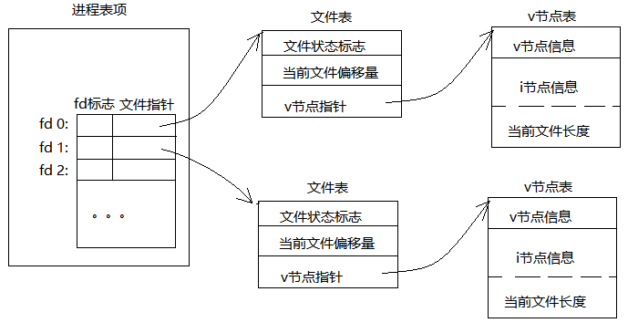
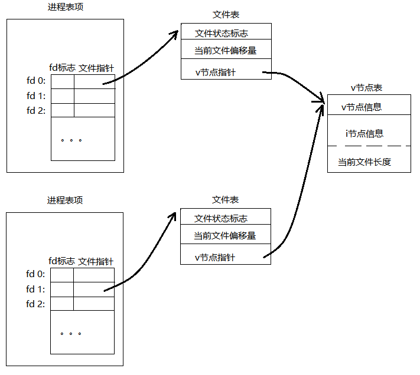
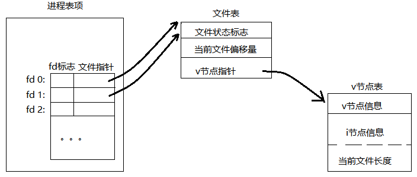
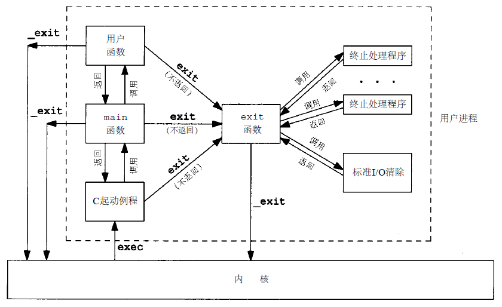
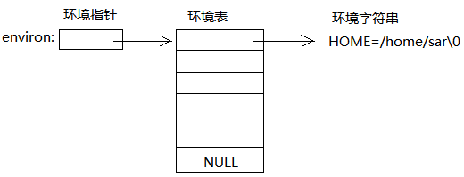

<!-- TOC -->

- [前言](#前言)
- [第一章 UNIX 基础知识](#第一章-unix-基础知识)
- [第二章 UNIX标准化及实现](#第二章-unix标准化及实现)
    - [UNIX标准和实现](#unix标准和实现)
    - [限制](#限制)
    - [选项](#选项)
    - [功能测试宏](#功能测试宏)
    - [基本系统数据类型](#基本系统数据类型)
- [第三章 文件 I/O](#第三章-文件-io)
    - [引言](#引言)
    - [文件描述符](#文件描述符)
    - [open 函数](#open-函数)
    - [creat 函数](#creat-函数)
    - [close 函数](#close-函数)
    - [lseek 函数](#lseek-函数)
    - [read 函数](#read-函数)
    - [write 函数](#write-函数)
    - [I/O效率](#io效率)
    - [文件共享](#文件共享)
    - [原子操作](#原子操作)
    - [dup 和 dup2](#dup-和-dup2)
    - [sync、fsync和fdatasync函数](#syncfsync和fdatasync函数)
    - [fcntl 函数](#fcntl-函数)
    - [ioctl 函数](#ioctl-函数)
    - [/dec/fd](#decfd)
- [第四章 文件和目录](#第四章-文件和目录)
    - [stat、fstat和lstat函数](#statfstat和lstat函数)
    - [文件类型](#文件类型)
    - [设置用户ID和设置组ID](#设置用户id和设置组id)
    - [文件访问权限](#文件访问权限)
    - [新文件和目录的所有权](#新文件和目录的所有权)
    - [access函数](#access函数)
    - [umask 函数](#umask-函数)
    - [chmod 和 fchmod 函数](#chmod-和-fchmod-函数)
    - [粘住位](#粘住位)
    - [chown、fchown 和 lchown 函数](#chownfchown-和-lchown-函数)
    - [文件长度](#文件长度)
    - [文件截短](#文件截短)
    - [文件系统](#文件系统)
    - [link、unlink、remove和rename函数](#linkunlinkremove和rename函数)
    - [符号链接](#符号链接)
    - [文件的时间](#文件的时间)
    - [mkdir 和 rmdir 函数](#mkdir-和-rmdir-函数)
    - [读目录](#读目录)
    - [chdir、fchdir、getcwd](#chdirfchdirgetcwd)
- [第五章 标准I/O库](#第五章-标准io库)
- [第六章 系统数据文件和信息](#第六章-系统数据文件和信息)
- [第七章 进程环境](#第七章-进程环境)
    - [main 函数](#main-函数)
    - [进程终止](#进程终止)
    - [命令行参数](#命令行参数)
    - [环境表](#环境表)
    - [C程序的存储空间布局](#c程序的存储空间布局)
    - [共享库](#共享库)
    - [存储器分配](#存储器分配)
    - [环境变量](#环境变量)
    - [setjmp 和 longjmp 函数](#setjmp-和-longjmp-函数)
    - [getrlimit 和 setrlimit 函数](#getrlimit-和-setrlimit-函数)
- [第八章 进程控制](#第八章-进程控制)
    - [进程标识符](#进程标识符)
    - [fork 函数](#fork-函数)
    - [vfork 函数](#vfork-函数)
    - [exit 函数](#exit-函数)
    - [wait 和 waitpid 函数](#wait-和-waitpid-函数)
    - [waitid 函数](#waitid-函数)
    - [wait3 和 wait4 函数](#wait3-和-wait4-函数)
    - [竞争条件](#竞争条件)
    - [exec 函数](#exec-函数)
    - [更改用户ID和组ID](#更改用户id和组id)
    - [解释器文件](#解释器文件)
    - [system 函数](#system-函数)
    - [进程会计](#进程会计)
    - [用户标识](#用户标识)
    - [进程时间](#进程时间)
- [第九章 进程关系](#第九章-进程关系)
    - [终端登录](#终端登录)
    - [网络登录](#网络登录)
    - [进程组](#进程组)
    - [会话](#会话)
    - [控制终端](#控制终端)
    - [tcgetpgrp, tcsetpgrp 和 tcgetsid 函数](#tcgetpgrp-tcsetpgrp-和-tcgetsid-函数)
    - [作业控制](#作业控制)
    - [孤儿进程组](#孤儿进程组)
- [第十章 信号](#第十章-信号)
    - [信号概念](#信号概念)
    - [signal 函数](#signal-函数)
    - [中断的系统调用](#中断的系统调用)
    - [可重入函数](#可重入函数)
    - [kill 和 raise 函数](#kill-和-raise-函数)
    - [alarm 和 pause 函数](#alarm-和-pause-函数)
    - [信号集](#信号集)
    - [sigprocmask 函数](#sigprocmask-函数)
    - [sigpending 函数](#sigpending-函数)
    - [sigaction 函数](#sigaction-函数)
    - [sigsetjmp 和 siglongjmp 函数](#sigsetjmp-和-siglongjmp-函数)
    - [sigsuspend 函数](#sigsuspend-函数)
    - [abort 函数](#abort-函数)
    - [system 函数](#system-函数-1)
    - [sleep 函数](#sleep-函数)
    - [作业控制信号](#作业控制信号)
- [第十一章 线程](#第十一章-线程)
    - [线程概念](#线程概念)
    - [线程标识](#线程标识)
    - [线程创建](#线程创建)
    - [线程终止](#线程终止)
    - [线程同步](#线程同步)
        - [互斥量](#互斥量)
        - [避免死锁](#避免死锁)
        - [读写锁](#读写锁)
        - [条件变量](#条件变量)
- [第十二章 线程控制](#第十二章-线程控制)
- [第十三章 守护进程](#第十三章-守护进程)
- [第十四章 高级I/O](#第十四章-高级io)
    - [非阻塞IO](#非阻塞io)
    - [记录锁](#记录锁)
    - [STREAMS](#streams)
    - [IO多路转接](#io多路转接)
        - [select](#select)
        - [pselect](#pselect)
        - [poll](#poll)
    - [readv 和 writev 函数](#readv-和-writev-函数)
    - [readn 和 writen 函数](#readn-和-writen-函数)
    - [存储映射IO](#存储映射io)
- [第十五章 进程间通信](#第十五章-进程间通信)
    - [管道](#管道)

<!-- /TOC -->
## 前言
本文档是笔者阅读apue（Advanced Programming in the UNIX Environment second edition）时候的笔记，如有不正确的地方欢迎指正

---

## 第一章 UNIX 基础知识

* 操作系统：定义为一种软件，控制计算机硬件资源，提供程序运行环境。
* 内核、系统调用、库函数、shell、应用软件
* 系统口令文件：/etc/passwd
* 各种常见的shell
* 文件系统：man 1 ls
* 工作目录：chdir
* 起始目录：登录时的工作目录，从口令文件中取得
* 输入和输出：
    * 文件描述符
    * 标准输入、输出、出错，程序启动时默认打开，shell重定向 < 和 >
    * 不用缓冲的I/O：open、read、write、lseek、close，STDIN_FILENO、STDOUT_FILENO，unistd.h
    * 标准I/O：stdio.h，getc、putc，stdin、stdout、EOF
* 程序、进程、进程ID（非负整数）
* 进程控制：fork、exec、waitpid。exec有六种变体，统称为exec函数
    * fork和跟随其后的exec两者组合，产生（spawn）一个新进程
* 线程：一个进程内的所有线程共享同一地址空间、文件描述符、栈以及与进程相关的属性，共享数据需要同步
    * 线程ID，只在所属进程内起作用
* 出错处理：
    * UNIX函数出错时常返回一个**负值**，整型变量*errno*通常被设置为含有附加信息的一个值。
    * 返回指向对象指针的大多数函数，出错时，返回null指针
    * errno.h：man 3 errno
        * 如果没有出错，则其值不会被一个例程清除，仅当函数的返回值指明出错时，才检验其值
        * 任一函数都不会将errno值设置为0
    * stderror 函数 和 perror 函数打印出错信息
    * 每个线程都有属于自己的局部errno
    * 致命性出错和非致命性出错
        * 非致命性出错一般是资源相关，可以等待一会再试，如：EAGAIN、ENFILE、ENOBUFS、ENOLCK、ENOSPC、ENOSR、EWOULDBLOCK等
* 用户ID、组ID、附加组ID：/etc/group
* 信号（signal）：通知进程已发生某种情况的一种技术，进程处理信号的三种方式：
    * 忽略该新号
    * 按系统默认的方式处理：如除以0，默认终止进程
    * 提供一个函数，新号发生时调用该函数，捕捉该信号。
* 时间值：
    * 日历时间：从1970年1月1日00:00:00 以来国际标准时间（UTC）所经历的秒数累计，time_t
    * 进程时间，也称CPU时间，clock_t
        * 时钟时间：墙上时钟时间，wall clock time，进程运行的时间总量
        * 用户CPU时间：执行用户指令所用的时间
        * 系统CPU时间：该进程执行内核程序所经历的时间
* 系统调用和库函数
    * man 2 和 man 3
    * sbrk(2) 和 malloc 的区别
    * 系统调用返回国际标准时间1970年1月1日0点以来锁经过的秒数

---

## 第二章 UNIX标准化及实现

### UNIX标准和实现
* 标准提供一堆头文件
* IOS C
* IEEE POSIX
* Single UNIX Specification，XSI（X/Open 系统接口）
* 各个标准定义了任一实际系统的子集

### 限制
* UNIX系统实现定义了很多幻数和常量
* 两种类型的限制是必需的：
    * 编译时限制（例如，短整型的最大值是什么）
    * 运行时限制（例如，文件名可以有多少个字符）
* 有些限制在某个实现中是固定的，而在另一个实现上可能是变化的，因此提供了以下三种限制：
    * 编译时限制（头文件）
    * 不于文件或目录相关联的运行时限制（sysconf函数）
    * 于文件或目录相关联的运行时限制（pathconf 和 fpathconf 函数）
* ISO C 限制，都是编译时限制，limits.h
* POSIX 限制
* XSI 限制
* 运行时限制，通过函数取得：sysconf、pathconf、fpathconf
* 不确定的运行时限制，如果这些限制值没有在头文件limits.h中定义，那么在编译时也不能使用它们，但是，如果它们的值是不确定的，那么在运行时它们也可能是未定义的

### 选项
* POSIX.1可选接口和XSI选项组
* Single UNIX Specification定义了三种处理方法：
    * 编译时选项定义在 unistd.h 
    * 与文件或目录无关的选项用sysconf确定
    * 与文件或目录相关的选项用pathconf或fpathconf函数发现
* 如果该平台定义了符号常量，则有一下三种可能：
    * 如果符号常量的定义值为-1，则该平台不支持相应的选项
    * 如果符号常量的定义值大于0，则该平台支持相应的选项
    * 如果符号常量的定义值为0，那么必须调用sysconf、pathconf或fpathconf以确定相应的选项是否支持

### 功能测试宏
* _POSIX_C_SOURCE: 当定义该常量时，可以排除任何实现专有的定义
* _XOPEN_SOURCE
* 可以在编译是指定-D，也可以在源文件的第一行设置#define
* \_\_STDC__:由符合IOS C标准的C编译器自动定义

### 基本系统数据类型
* 与系统实现有关的数据类型，\<sys/types.h>，通常以 _t 结尾
* 使用这种方式定义的数据类型，不需要考虑因系统而已的程序实现细节。

---

## 第三章 文件 I/O

### 引言
* 不带缓冲的I/O:open、read、write、lseek、close
* 多个进程间共享资源，原子操作

### 文件描述符
* 内核通过文件描述符引用打开的文件
* 非负整数
* unistd.h: STDIN_FILENO、STDOUT_FILENO、STDERR_FILENO
* 文件描述符的范围：0~OPEN_MAX

### open 函数
``` c++
#include <fcntl.h>
int open(const char *pathname, int oflag, ... /* mode_t mode */);
```
* oflag:
    * 必须指定，且只能指定一个：
        * O_RDONLY 只读打开
        * O_WRONLY 只写打开
        * O_RDWR 读、写打开
    * 可选：
        * O_APPEND
        * O_CREAT
        * O_EXCL
        * O_TRUNC
        * O_NOCTTY
        * O_NONBLOCK
    * Single UNIX Specification 的可选标志
        * O_DSYNC
        * O_RSYNC
        * O_SYNC
* open 返回的文件描述符一定是最小的未yoga描述符数值
* 文件名和路径阶段：如果NAME_MAX是14，而我们试图在当前目录中创建一个文件名包含15个字符的新文件时，会被截断成14个字符，有些系统不给任何信息，而有些系统会返回出错状态，并将errno设置为ENAMETOOLONG
* POSIX.1中_POSIX_NO_TRUNC决定了是截断还是返回出错。

### creat 函数
``` c++
#include <fcntl.h>
int creat(const char *pathname, mode_t mode);
```
* 次函数等价于： open(pathname, O_WRONLY | O_CREAT | O_TRUNC, mode);
* mode 指定文件访问权限

### close 函数
``` c++
#include <fcntl.h>
int close(int filedes);
```
* 当关闭一个文件时还会释放该进程加在该文件上的记录锁
* 当一个进程终止时，内核自动关闭它所有打开的文件。

### lseek 函数
``` c++
#include <fcntl.h>
off_t lseek(int filedes, off_t offset, int whence);
```
* 每个打开的文件都有一个与其相关联的“当前文件偏移量”，非负整数，度量从文件开始处计算的字节数。
* 按系统默认的情况，当一个文件打开时除非指定O_APPEND，否则当前文件偏移量设置为0
* offset和whence解释：
    * if whence == SEEK_SET, 则将该文件的偏移量设置为距文件开始处offset个字节。
    * if whence == SEEK_CUR, 则将文件偏移量设置为当前值+offset，offset可为正或负。
    * if whence == SEEK_END, 则将文件偏移量设置为文件长度+offset，offset可为正或负。
* 如果文件描述符是一个管道、FIFO或网络套接字，则lseek返回-1，并将errno设置为ESPIPE：
    * curpos = lseek(fd, 0, SEEK_CUR);
* lseek成功则返回新的文件偏移量
* lseek 可能允许负的偏移量，所以判断返回值应该用==-1，而不是<0
* lseek仅将当前的文件偏移量记录在内核中，不引起任何I/O操作。
* 空洞文件：文件中没有写过的字节都被读为0
* od -c file : 以字符方式打印文件内容

### read 函数
``` c++
#include <fcntl.h>
ssize_t read(int filedes, void *buf, size_t nbytes);
```
* 返回值：若成功返回读到的字节数，若已到文件尾则返回0，若出错则返回-1
* 实际读到的字节数少于要求读的字节数：
    * 读普通文件时，在读到要求字节数之前已达到了文件尾，下一次再调用read时返回0
    * 从终端设备读时，通常一次最多读一行（可以改变）
    * 从网络读时，网络中的缓冲机构可能造成返回值小于所要求读的字节数
    * 从管道或FIFO读时，若管道包含的字节少于所需的数量，read返回实际可用的字节数
    * 从某些面向记录的设备读时，一次最多返回一个记录
    * 当某一信号造成中断，而已经读了部分数据量时

### write 函数
``` c++
#include <fcntl.h>
ssize_t write(int filedes, const void *buf, size_t nbytes);
```
* 返回值需要与nbytes的值相同，否则表示出错，出错通常是因为磁盘已满或者超过了一个给定进程的文件长度限制

### I/O效率
* 从一个文件读内容写到领一个文件中，read和write的nbytes选择会影响读写的效率
* 文件系统预读（read ahead）技术：当检测到正在顺序读取时，系统试图读入比应用程序所要求的更多数据，并假想应用程序很快就会读到这些数据。
* 注意重复测试时可能会从系统缓存访问文件，导致无需读、写磁盘。

### 文件共享
* 一个进程打开文件的内核数据结构
    * 
* 进程表中的记录项
* 内核为打开的文件维护一张文件表
* v-node 和 i-node:这些信息在打开文件时从磁盘上读入内存，包含文件的所有者、文件长度、所在设备、指向文件实际数据块在磁盘上所在位置的指针等。
* 两个独立进程个字打开同一个文件
    * 
* 可能有多个文件描述符项指向同一个文件表项，如dup，以及fork后父子进程对于每一个打开文件描述符共享同一个文件表项。
* 注意O_APPEND和lseek定位到文件当前的尾端的区别，O_APPEND每次写的时候会先设置偏移量再写，而lseek则只是设置为偏移为当前的文件长度。

### 原子操作
* 如果两个进程对同一个文件进行lseek和write操作时，会出现问题，这时需要原子操作
* Single UNIX Specification中的XSI扩展提供的原子操作
``` c++
#include <unistd.h>
ssize_t pread(int filedes, void *buf, size_t nbytes, off_t offset);
ssize_t pwrite(int filedes, const void *buf, size_t nbytes, off_t offset);
```
* pread 等价于 顺序调用lseek和read的原子操作
* pwrite 同理
* 使用O_APPEND 在写的时候等价于lseek到文件末尾再write的原子操作
* open 设置O_CREAT 和O_EXCL 选项时也是一个原子操作，如果文件不存在则创建新文件

### dup 和 dup2
* 复制一个现存的文件描述符
``` c++
#include <unistd.h>
int dup(int filedes);
int dup2(int filedes, int filedes2);
// 返回值：若成功，返回新的文件描述符，若出错，返回-1
```
* dup 返回的新文件描述符一定是当前可用文件描述符中的最小数值
* dup2 用filedes2参数指定新描述符的数值，如果filedes2已经打开，则先将其关闭。如果filedes等于filedes2，则dup2返回filedes2，而不关闭它。
* 使用fcntl函数也可以复制描述符
``` c++
// dup(filedes)
fcntl(filedes, F_DUPFD, 0);

// dup2(filedes, filedes2)
close(filedes2);
fcntl(filedes, F_DUPFD, filedes2);
// 注意dup2是一个原子操作， dup2和fcntl有不同的errno
```
* 复制文件描述符的内核数据结构图
    * 


### sync、fsync和fdatasync函数
* 延迟写（delayed write），内核缓冲区，减少磁盘读写次数，系统发生故障时可能会丢失内容
* 为了保证磁盘上实际文件系统与缓冲区高速缓存中内容的一致性
``` c++
#include <unistd.h>
int fsync(int filedes);
int fdatasync(int filedes);
void sync(void);
```
* sync函数只是将所有修改过的块缓冲区排入写队列，然后就返回，并不等待实际写磁盘操作结束
* update系统守护进程周期性（一般为30s）调用sync函数，命令sync(1)
* fsync只对filedes指定的单一文件起作用，并且等待磁盘操作结束，然后返回
* fdatasync类似于fsync，但只影响文件的数据部分，fsync会同步更新文件的属性

### fcntl 函数
* 改变已经打开的文件的性质
``` c++
#include <fcntl.h>
int fcntl(int filedes, int cmd, ... /* int arg */);
// 返回值：若成功则依赖于cmd，若出错则返回-1
```
* fcntl 的五种功能
    * cmd=F_DUPFD 复制一个现有的描述符
    * cmd=F_GETFD或F_SETFD 获得/设置文件描述符标记
    * cmd=F_GETFL或F_SETFL 获得/设置文件状态标志
    * cmd=F_GETOWN或F_SETOWN 获得/设置异步I/O所有权
    * cmd=F_GETLK、F_SETLK、F_SETLKW 获得/设置记录锁
* F_GETFL 三个访问方式标志（O_RDONLY、O_WRONLY、O_RDWR）互斥，必须使用屏蔽字 **O_ACCMODE** 取得


### ioctl 函数
* 实现read、write、lseek之外的io功能，如在磁带上写一个文件结束标志、反绕磁带、越过指定个数的文件或记录等。
* 因系统而异，对不同的设备会有不同的ioctl命令，以及相应的头文件
``` c++
#include <unistd.h> // System V
#include <sys/ioctl.h>  // BSD and Linux
#include <stropts.h>    // XSI STREAMS
int ioctl(int filedes, int request, ...);
```

### /dec/fd
* 打开文件/dev/fd/n 等效于复制描述符n（假定描述符n是打开的）
* fd = open("/dev/fd/0", mode); 等效于 fd = dup(0); 系统会忽略这里的mode，使用原先打开的mode
* 用/dev/fd作为路径名参数调用creat，等效于调用open时，用 O_CREAT 作为第二个参数
* /dev/stdin、/dev/stdout、/dev/stderr 等效于 /dev/fd/0、/dev/fd/1、、/dev/fd/2
* shell 中使用/dev/fd作为调用参数，能用处理其他路径名的相同方式处理标准输入输出

---

## 第四章 文件和目录

### stat、fstat和lstat函数
``` c++
#include <sys/stat.h>
int stat(const char *restrict pathname, struct stat *restrict buf);
int fstat(int filedes, struct stat *buf);
int lstat(const char *restrict pathname, struct stat *restrict buf);
// 三个函数的返回值：若成功返回0，若出错返回-1
```
* lstat: 当命名的文件是一个符号链接时，lstat返回该符号链接的有关信息，而不是由该符号链接应用文件的信息。

### 文件类型
* 普通文件
* 目录文件
* 快特殊文件
* 字符特殊文件
* FIFO
* 套接字
* 符号链接
* 文件类型信息保存在stat结构的st_mode成员中：
    * S_ISREG()、S_ISDIR()、S_ISCHR()、S_ISBLK()、S_ISFIFO()、S_ISLNK()、S_ISSOCK()
* IPC对象表示为文件：
    * S_TYPEISMQ()
    * S_TYPEISSEM()
    * S_TYPEISSHM()

### 设置用户ID和设置组ID
* 实际用户ID、实际组ID
* 有效用户ID、有效组ID、附加组ID
* 保存的设置用户ID、保存的设置组ID

### 文件访问权限
* 用名字打开任一类型的文件时，对该名字中包含的每一个目录，包括它可能隐含的当前工作目录都应具有执行权限
* 对于一个文件的读权限决定了我们是否能够打开该文件进行读操作
* 对于一个文件的写权限决定了我们是否能够打开该文件进行写操作
* open函数对一个文件制定O_TRUNC，必须对该文件具有写权限
* 在一个目录中创建一个新文件，必须对该目录具有写权限和执行权限
* 删除一个现有的文件，必须对包含该文件的目录具有写权限和执行权限。对该文件本身则不需要有读写权限。
* 用6个exec函数中的任何一个执行某个文件，必须对该文件具有执行权限。该文件还必须是一个普通文件。

### 新文件和目录的所有权
* 新文件的用户ID设置为进程的有效用户ID
* 组ID可选择:
    * 新文件的组ID可以是进程的有效组ID
    * 新文件的组ID可以是它所在目录的组ID

### access函数
``` c++
#include <unistd.h>
int access(const char *pathname, int mode);
// 成功返回0，失败返回-1
```
* mode 常量，unistd.h
    * R_OK 测试读权限
    * W_OK 测试写权限
    * X_OK 测试执行权限
    * F_OK 测试文件是否存在

### umask 函数
``` c++
#include <sys/stat.h>
mode_t umask(mode_t cmask);
// 返回值：以前的文件模式创建屏蔽字
```
* 进程创建一个新文件或目录时，就一定会使用文件模式创建屏蔽字
* 对于任何在文件模式创建屏蔽字中为1的位，在文件mode中的相应位则一定被关闭

### chmod 和 fchmod 函数
``` c++
#include <sys/stat.h>
int chmod(const char *pathname, model_t mode);
int fchmod(int filedes, mode_t mode);
// 成功返回0，失败返回-1
```
* 为了改变一个文件的权限位，进程的有效用户ID必须等于文件的所有者ID，或者该进程必须具有超级用户权限

### 粘住位
* S_ISVTX
* 如果一个可执行文件的这一位被设置了，那么在该程序第一次被执行并结束时，其程序正文部分的一个副本仍被保存在交换区。
* 如果对一个目录设置了粘住位，只有对该目录具有写权限的用户在满足下列条件之一的情况下才能删除或更名该目录下的文件：
    * 拥有此文件
    * 拥有此目录
    * 是超级用户
* 目录/tmp 和 /var/spool/uucppublic，任何用户都可在这两目录中创建文件，任一用户对这两个目录的权限通常是读、写和执行，但用户不应能删除或更名属于其他人的文件

### chown、fchown 和 lchown 函数
``` c++
#include <unistd.h>
int chown(const char *pathname, uid_t owner, gid_t group);
int fchown(const char *pathname, uid_t owner, gid_t group);
int lchown(const char *pathname, uid_t owner, gid_t group);
// 成功返回0，失败返回-1
```
* 除了所引用的文件是符号链接以外，三个函数的操作相似
* 在符号链接的情况下，lchown更改符号链接本身的所有者，而不是改符号链接指向的文件。
* owner和group若为-1，则不改变
* _POSIX_CHOWN_RESTRICTED 

### 文件长度
* 普通文件，长度可以是0，读这种文件时，将得到文件结束指示
* 对于目录文件，文件长度通常是一个数的倍数，如16或512
* 对于符号链接，文件长度是文件名中的实际字节数
* 文件中的空洞

### 文件截短
* 将一个文件清0，可以在打开文件时使用O_TRUNC标志
* 把现有的文件长度截短
``` c++
#include <unsitd.h>
int truncate(const char *pathname, off_t length);
int ftruncate(int filedes, off_t length);
// 成功返回0，失败返回-1
```

### 文件系统
* UFS, UNIX file system
* i节点：固定长度的记录项，包含有关文件的大部分信息
* i节点链接计数，硬链接会增加计数，计数减少至0时才删除文件
* 符号链接，文件的实际内容包含该符号链接指向的文件的名字，文件类型为S_IFLNK
* 目录项中包含文件名和i节点编号
* 文件更名：文件的实际内容未移动，只需构造一个指向现有i节点的新目录项，并解除与旧目录项的链接

### link、unlink、remove和rename函数
``` c++
#include <unistd.h>
int link(const char *existingpath, const char *newpath);
int ulink(const char *pathname);
int remove(const char *pathname);
int rename(const char *oldname, const char *newname);
```
* link: 创建新目录项并增加链接计数
* unlink：删除目录项，并将由pathname所引用文件的链接计数减1
* 只有当链接计数达到0时，文件内容才可被删除。另外如果有进程打开了该文件，计数到0也不会删除。
* unlink这种性质可用来确保即使在进程崩溃时，它所创建的临时文件也不会遗留下来。
* 对于文件，remove与unlink功能相同。对于目录，remove与rmdir相同

### 符号链接
* 硬链接通常要求链接和文件位于同一文件系统中
* 只有超级用户才能创建指向目录的硬链接：因为很容易构成循环
* 处理循环：用lstat代替stat，不跟随符号链接
* 当使用以名字引用文件的函数时，应当了解该函数是否处理符号链接，也就是该函数是否跟随符号链接到达它所链接的文件。
``` c++
#include <unistd.h>
int symlink(const char *actualpath, const char *sympath);
ssize_t readlink(const char *restrict pathname, char *restrict buf, size_t bufsize);
```

### 文件的时间
* st_mtime: 修改时间，文件内容最后一次被修改的时间
* st_ctime: 更改状态时间，i节点最后一次被修改的时间
*  修改文件的访问和修改时间
``` c++
#include <utime.h>
int utime(const char *pathname, const struct utimbuf *times);
struct utimbuf {
    time_t actime;      // access time
    time_t modtime;     // modification time
};
```
* 如果times是空指针，则访问时间和修改时间都被设置为当前时间

### mkdir 和 rmdir 函数
``` c++
#include <sys/stat.h>
int mkdir(const char *pathname, mode_t mode);
int rmdir(const char *pathname);
```

### 读目录
* 只有内核才能写目录，一个目录的写权限位和执行权限位决定了该目录中能否创建新文件以及删除文件
``` c++
#include <dirent.h>
DIR *opendir(const char *pathname);
struct dirent *readdir(DIR *dp);
void rewinddir(DIR *dp);
int closedir(DIR *dp);
long telldir(DIR *dp);
void seekdir(DIR *dp, long loc);
```

### chdir、fchdir、getcwd
``` c++
#include <unistd.h>
int chdir(const char *pathname);
int fchdir(int filedes);
char *getcwd(char *buf, size_t size);
```
---

## 第五章 标准I/O库

---

## 第六章 系统数据文件和信息
* 口令文件
* 阴影口令
* 组文件
* 附加组ID
* 登录账户记录
* 系统标识：uname gethostname
* 时间和日期例程： time gettimeofday gmtime localtime mktime asctime ctime strftime

---

## 第七章 进程环境
### main 函数
* 当内核执行C程序时（使用exec函数），会在调用main函数前先调用一个特殊的启动例程
* 启动例程从内核取得命令行参数和环境变量值，然后调用main函数：exit(main(argc, argv))

### 进程终止
* 正常终止
    * 从main返回
    * 调用exit
    * 调用_exit 或 _Exit
    * 最后一个线程从其启动例程返回
    * 最后一个现存调用pthread_exit
* 异常终止
    * 调用abort
    * 接到一个信号并终止
    * 最后一个线程对取消请求作出相应
* exit 函数
    * _exit 和 _Exit 立即进入内核，exit则先执行一些清理处理，包括调用执行各终止处理程序，关闭所有标准I/O流等，然后进入内核
    * status，终止状态
``` c++
#include <stdlib.h>
void exit(int status);
void _Exit(int status);
#include <unistd.h>
void _exit(int status);
```
* atexit 函数
    *一个进程可以登记多达32个函数，这些函数将由exit自动调用，称为终止处理程序（exit handler）,通过调用atexit函数来登记这些函数
    * exit调用这些函数的顺序与它们登记时候的顺序**相反**
``` c++
#include <stdlib.h>
int atexit(void (*func)(void));
```
* 如若程序调用exec函数族中的任一函数，则将清除所有已安装的终止处理程序
* 一个C程序是如何启动和终止的
    * 

### 命令行参数
* 调用exec的进程可将命令行参数传递给新程序
* argv[argc]是一个空指针，NULL

### 环境表
``` c++
extern char **environ;
```


### C程序的存储空间布局
* 正文段：CPU执行的机器指令部分，通常是共享的，在存储器中只需要一个副本。通常是只读的
* 初始化数据段，在任何函数之外的声明：int maxcount = 99;
* 非初始化数据段，在任何函数外的声明： long sum[1000];
* 栈，自动变量以及每次函数调用时所需保存的信息
* 堆，动态存储分配
* 非初始化数据段的内容不存放在磁盘上的程序文件中，内核在程序开始运行前将它们都设置为0

### 共享库
* 可执行文件中不再需要包含公用的库例程，只需要在所有进程都可引用的存储区中维护这种例程的一个副本
* 减少每个可执行文件的长度，增加运行时开销，开销发生在该程序第一次被执行时，或者每个共享库函数第一次被调用时

### 存储器分配
* malloc、calloc、realloc
* 返回指针对齐
* sbrk、mmap 系统调用 
* 大多数实现锁分配的存储空间比所要求的的要稍大一些，额外的控件用来记录管理信息
* 深入探索内存分配管理，malloc、tcmalloc、jemalloc
* linux内存管理
* 物理内存和虚拟内存

### 环境变量
``` c++
#include <stdlib.h>
char *getenv(const char *name); // 返回值：指向与name关联的value指针，若未找到则返回NULL
int putenv(char *str);
int setenv(const char *name, const char *value, int rewrite);
int unsetenv(const char *name);
// 返回值：成功返回0，出错返回非0
```
* putenv: 若name存在，则先删除其原来的定义
* setenv: 若name存在，rewrite为非0则先删除其定义，若为0则不删除其现用定义

### setjmp 和 longjmp 函数
``` c++
#include <setjmp.h>
int setjmp(jmp_buf env);    // 若直接调用返回0，若从longjmp调用返回则返回非0值
void longjmp(jmp_buf env, int val); // val将成为从setjmp处返回的值
```
* 在希望返回到的位置调用setjmp
* 自动、寄存器和易失变量longjmp后不同的情况
* 全局、静态和易失变量在longjmp后是最近锁呈现的值
* 自动变量一般longjmp之后不确定，也可能和编译器优化有关

### getrlimit 和 setrlimit 函数
``` c++
#include <sys/resource.h>
int getrlimit(int resource, struct rlimit *rlptr);
int setrlimit(int resource, const struct rlimit *rlptr);
struct rlimit {
    rlim_t rlim_cur;
    rlim_t rlim_max;
};
```
* 每个进程有一组资源限制，可用这两函数查询和修改

---

## 第八章 进程控制

### 进程标识符
* 非负整数，唯一
* 进程终止后，其进程ID就可以再次使用，延迟重用算法
* ID为0的进程：调度进程，交换进程，内核的一部分
* ID为1的进程：init进程，用户进程，所有孤儿进程的父进程
* ID为2的进程：页守护进程（pagedaemon）
``` c++
#include <unistd.h>
pid_t getpid(void);     // 返回调用进程的进程ID
pid_t getppid(void);    // 返回调用进程的父进程ID
uid_t getuid(void);     // 返回调用进程的实际用户ID
uid_t geteuid(void);    // 返回调用进程的有效用户ID
gid_t getgid(void);     // 返回调用进程的实际组ID
gid_t getegid(void);    // 返回调用进程的有效组ID
```

### fork 函数
``` c++
#include <unistd.h>
pid_t fork(void);
// 子进程中返回0，父进程中返回子进程ID，出错返回-1
```
* 父进程中返回子进程ID的原因：一个进程的子进程可以有多个，并且没有一个函数使一个进程可以获得其所有子进程的进程ID
* 父子进程共享正文段，不共享数据空间、堆和栈
* 写时复制（Copy on Write），fork时数据段、栈和堆由父子进程共享，而且内核将它们的访问权限改为只读，如果父子进程中的任一个试图修改这些区域，则内核只为修改区域的那块内存制作一个副本，通常是虚拟存储系统中的一“页”
* 有些实现可以控制哪些部分由父、子进程共享，如linux中的clone(2)
* 注意fork时，标准I/O库的缓冲区也会被拷贝
* 文件共享：在重定向父进程的标准输出时，子进程的标准输出也被重定向
* 父进程的所有打开文件描述符都被复制到子进程中，父子进程的每个相同的打开描述符共享一个文件表项。
* 子进程继承父进程的内容：
    * 打开文件
    * 实际用户ID、实际组ID、有效用户ID、有效组ID
    * 附加组ID
    * 进程组ID
    * 会话ID
    * 控制终端
    * 设置用户ID标志和设置组ID标志
    * 当前工作目录和根目录
    * 文件模式创建屏蔽字
    * 信号屏蔽和安排
    * 针对任一打开文件描述符的在执行时关闭（close-on-exec）标志
    * 环境
    * 链接的共享存储端
    * 储存映射
    * 资源限制
* 父子进程之间的区别
    * fork的返回值
    * 进程ID
    * 父进程ID
    * 子进程的tms_utime、tms_stime、tms_cutime以及tms_ustime均被设置为0
    * 父进程设置的文件锁不会被子进程继承
    * 子进程的未处理的闹钟（alarm）被清除
    * 子进程的未处理信号集设置为空集
* fork和exec组合成一个：spawn
* fork父子进程谁先返回不确定

### vfork 函数
* vfork不将父进程的地址空间完全复制到子进程
* 子进程在调用exec或exit之前，它在父进程的空间中运行
* 子进程先运行，调用exec和exit之后，父进程才可能被调度运行，否则处于休眠
* 子进程一般用_exit而不用exit，因为子进程调用exit的话，会关闭标准I/O流，导致回到父进程中不可用了

### exit 函数
* 如果父进程在子进程之前终止，则子进程的父进程改变为init
* 如果子进程在父进程之前终止，父进程不wait或waitpid，则子进程成为僵死进程
* 内核为每个终止子进程保存了一定量的信息，父进程可以调用wait或者waitpid获得，这些信息包括：进程ID、该进程的终止状态、以及该进程使用的CPU时间总量。
* 一个被init进程领养的进程终止是不会成为僵死进程，因为init会调用wait函数取得其终止状态

### wait 和 waitpid 函数
``` c++
#include <sys/wait.h>
pid_t wait(int *statloc);
pid_t waitpid(pid_t pid, int *statloc, int options);
```
* 当一个进程正常或异常终止时，内核向其父进程发送SIGCHLD信号
* 这两个函数的区别：
    * 在一个子进程终止前，wait使其调用者阻塞，而waitpid有一个选项，可以使调用者不阻塞
    * waitpid并不等待在起调用之后的第一个终止子进程，它有若干个选项，可以控制它所等待的进程
* waitpid函数中pid参数的作用：
    * pid == -1, 等待任一子进程，就这方面而言，和wait等效
    * pid > 0, 等待其进程ID与pid相等的子进程
    * pid == 0, 等待其组ID等于调用进程组ID的任一子进程
    * pid < -1, 等待其组ID等于pid绝对值的任一子进程
* 如果一个进程fork一个子进程，但不要它等待子进程终止，也不希望子进程处于僵死状态知道父进程终止，实现这一要求的技巧是调用fork两次

### waitid 函数
``` c++
#include <sys/wait.h>
int waitid(idtype_t idtype, id_t id, siginfo_t *infop, int options);
```
* Solaris才支持
* waitid允许一个进程指定要等待的子进程，但它使用单独的参数表示要等待的子进程类型，与waitpid有区别

### wait3 和 wait4 函数
``` c++
#include <sys/types.h>
#include <sys/wait.h>
#include <sys/time.h>
#include <sys/resource.h>
pid_t wait3(int *statloc, int options, struct rusage *rusage);
pid_t wait4(pid_t pid, int *statloc, int options, struct rusage *rusage);
```
* 与wait和waitpid不同的地方在于多了一个rusage参数，该参数要求内核返回由终止进程及其所有子进程使用的资源汇总
* 资源统计信息包括用户CPU时间总量、系统CPU时间总量、页面出错次数、接收到信号的次数等
* getrusage(2)

### 竞争条件
* 当多个进程都企图对共享数据进行某种处理，而最后的结果又取决于进程运行的顺序

### exec 函数
``` c++
#include <unistd.h>
int execl(const char *pathname, const char *arg0, ... /* (char *)0 */);
int execv(const char *pathname, char *const argv[]);
int execle(const char *pathname, const char *arg0, ... /* (char *)0, char *const envp[] */);
int execve(const char *pathname, char *const argv[], char *const envp[]);
int execlp(const char *filename, const char *arg0, ... /* (char *)0 */);
int execvp(const char *filename, char *const argv[]);
```
* 执行exec后，新程序的进程保持原进程的下列特征：
    * 进程ID和父进程ID
    * 实际用户ID和实际组ID
    * 附加组ID
    * 进程组ID
    * 会话ID
    * 控制终端
    * 闹钟尚余留的时间
    * 当前工作目录
    * 根目录
    * 文件模式创建屏蔽字
    * 文件锁
    * 进程信号屏蔽
    * 未处理信号
    * 资源限制
    * tms_utime, tms_stime, tms_cutime, tms_cstime
    * 打开文件的处理与每个描述符的执行时关闭（close-on-exec，FD_CLOEXEC）标志值有关
* 只有execve是系统调用，其它函数只是库函数，最终会调用execve

### 更改用户ID和组ID
``` c++
#include <unistd.h>
int setuid(uid_t uid);
int setgid(gid_t gid);
```

### 解释器文件
* #! pathname [ optional-argument ]
* pathname 是绝对路径，不进行PATH搜索

### system 函数
``` c++
#include <stdlib.h>
int system(const char *cmdstring);
```
* system实现中调用了fork、exec和waitpid
* 如果fork失败或者waitpid返回除EINTR之外的错，则system返回-1
* 如果exec失败，则返回值如同shell执行了exit(127)一样
* 如果所有三个函数都执行成功，则返回值是shell的终止状态

### 进程会计
* 开启命令accton(8)
* 启用后，每当进程结束时内核就写一个会计记录，包含命令名、所使用的CPU时间总量、用户ID和组ID、启动时间等
* 保存的顺序为进程结束时间
* A exec B，然后B exec C，最后C exit，只会写一条会计记录，命令名对应于C，但CPU时间是程序A、B、C之和

### 用户标识
``` c++
#include <unistd.h>
char *getlogin(void);
```
* 获取运行该程序的用户登录名

### 进程时间
``` c++
#include <sys/times.h>
clock_t times(struct tms *buf);
// 若成功返回流逝的墙上时钟时间（单位：时钟滴答数），若出错返回-1
```

---

## 第九章 进程关系

### 终端登录
* BSD 终端登录
    * init -> fork -> (exec) getty -> (execle) login

### 网络登录
* 伪终端（pseudo terminal）
* BSD 网络登录
    * init -> inetd -> fork -> (exec) telnetd

### 进程组
``` c++
#include <unistd.h>
pid_t getpgrp(void);    // 返回调用进程的进程组id
pid_t getpgid(pid_t pid);   // 若成功返回进程组id，出错则返回-1， getpgid(0)与getpgrp()等价
int setpgid(pid_t pid, pid_t pgid); // 成功返回0，出错返回-1
```
* 一个或多个进程的集合
* 组长进程：进程组Id等于进程ID
* 只要在某个进程组中有一个进程存在，则该进程组就存在，与组长进程是否终止无关

### 会话
* 一个或多个进程组的集合
``` c++
#include <unistd.h>
pid_t setsid(void);
```
* 如果调用此函数的进程不是一个进程组的组长，则此函数会创建一个新会话，并发生下面3件事：
    * 该进程变成新会话的首进程（session leader）
    * 该进程成为一个新进程组的组长进程，新进程组ID就是改调用进程的进程ID
    * 该进程没有控制终端。如果在调用之前有一个控制终端，那么这种联系也会被中断
* 如果该调用进程已经是一个进程组的组长，则此函数返回出错
``` c++
#include <unistd.h>
pid_t getsid(pid_t pid);
```
* 若pid为0，返回调用进程的会话首进程的进程组ID
* 某些实现会限制：若pid并不属于调用者所在的会话，那么调用者就不能得到该会话首进程的进程组ID

### 控制终端
* 一个会话可以有一个控制终端（controlling terminal），通常是登录到其上的终端设备或伪终端设备
* 建立与控制终端连接的会话首进程称为控制进程
* 一个会话的几个进程组可被分为一个前台进程组以及一个或几个后台进程组
* 如果一个会话有一个控制终端，则它有一个前台进程组，会话中的其它进程组则为后台进程组
* 无论何时键入终端的中断键，就会将中断信号发送给前台进程组的所有进程
* 无论何时键入终端的退出键，就会将退出信号发送给前台进程组的所有进程
* 如果终端接口检测到调制解调器（或网络）已经断开连接，则将挂断信号发送给控制进程

### tcgetpgrp, tcsetpgrp 和 tcgetsid 函数
* 需要有一种方法来通知内核哪一个进程组是前台进程组，这样终端设备驱动程序就能了解将终端输入和终端产生的信号送往何处

### 作业控制
* 支持作业控制的shell，通常是一个进程的管道线
* 内核中的终端驱动程序必须支持作业控制
* 内核必须提供对某些作业控制信号的支持

### 孤儿进程组

---

## 第十章 信号

### 信号概念
* 信号都被定义为正整数
* 不存在编号为0的信号，kill函数对信号编号为0有特殊的应用
* 信号处理的三种动作：
    * 忽略此信号：SIGKILL和SIGSTOP不能被忽略，因为它们向超级用户提供了使进程终止或停止的可靠方法
    * 捕捉信号，要通知内核在某种信号发生时调用一个用户函数，SIGKILL和SIGSTOP信号不能捕捉
    * 执行系统默认动作，针对大多数信号的系统默认动作是终止进程，有些会生成core文件

### signal 函数
``` c++
#include <signal.h>
void (*signal(int signo, void (*func)(int)))(int);
// 若成功，返回信号以前的处理配置，若出错则返回SIG_ERR

// signal.h中的声明
#define SIG_ERR     (void (*)())-1
#define SIG_DFL     (void (*)())0
#define SIG_IGN     (void (*)())1
```
* func的值是常量SIG_IGN、常量SIG_DFL 或当接到此信号后要调用的函数的地址
* 当执行一个程序时，所有信号的状态都是系统默认或忽略
* exec函数将原先设置为要捕捉的信号都改为它们的默认动作，其它信号的状态则不变
* 当一个进程调用fork时，其子进程继承父进程的信号处理方式，因为子进程在开始时复制了父进程的存储映像，所以信号捕捉函数的地址在子进程中是有意义的

### 中断的系统调用

### 可重入函数
* 进程捕捉到新号并对其进行处理时，进程正在执行的指令就被信号处理程序临时终端，首先执行该信号处理程序中的指令，返回后继续执行在捕捉到信号时进程正在执行的正常指令序列
* 如果进程正在执行malloc，在其堆中分配另外的存储空间，此时信号处理程序又调用malloc，可能会对进程造成破坏

### kill 和 raise 函数
``` c++
#include <signal.h>
int kill(pid_t pid, int signo);
int raise(int signo);
```
* kill 函数将信号发送给进程或进程组，raise函数向进程自身发送信号
* raise(signo) 等价于 kill(getpid(), signo)
* kill 的pid参数：
    * pid > 0 将该信号发送给进程ID为pid的进程
    * pid == 0 将该信号发送给与发送进程属于同一进程组的所哟进程，而且发送进程具有向这些进程发送信号的权限
    * pid < 0 将信号发送给进程组ID等于pid的绝对值，切发送信号具有向其发送信号的权限
    * pid == -1 将该信号发送给发送进程有权限向它们发送信号的系统上的所有进程，不包括有些系统进程

### alarm 和 pause 函数
``` c
#include <unistd.h>
unsigned int alarm(unsigned int secondss); // 返回0或以前设置的闹钟时间的余留秒数
int pause(void); // 返回-1，并将errno设置为EINTR
```
* 每个进程只能有一个闹钟时钟
* SIGALRM的默认动作是终止进程
* pause函数使调用进程挂起直至捕捉到一个信号

### 信号集
* 一个能表示多个信号的数据类型：sigset_t
``` c
#include <signal.h>
int sigemptyset(sigset_t *set);
int sigfillset(sigset_t *set);
int sigaddset(sigset_t *set, int signo);
int sigdelset(sigset_t *set, int signo);
int sigismember(const sigset_t *set, int signo);
```

### sigprocmask 函数
* 进程的信号屏蔽字规定了当前阻塞而不能递送给该进程的信号集
* 在调用sigprocmask后如果有任何未决的、不再阻塞的信号，则再sigprocmask返回前，至少会将其中一个信号递送给该进程

### sigpending 函数
* 返回信号集，其中的各个信号对于调用进程是阻塞的而不能递送，因而也一定是当前未决的

### sigaction 函数
``` c
#include <signal.h>
int sigaction(int signo, const struct sigaction *restrict act, 
    struct sigaction *restrict oact);
```
* 检查或修改与指定信号相关联的处理动作（或同时执行这两种操作）
* signo 是要检测或修改其具体动作的信号编号，若act指针为非空，则要修改其动作，如果oact指针为非空，则系统经由oact指针返回该信号的上一个动作

### sigsetjmp 和 siglongjmp 函数

### sigsuspend 函数

### abort 函数
* 使异常程序终止
* 此函数将SIGABRT信号发送给调用进程

### system 函数

### sleep 函数

### 作业控制信号
* SIGCHILD
* SIGCONT
* SIGSTOP
* SIGTSTP
* SIGTTIN
* SIGTTOU

 ---

## 第十一章 线程

### 线程概念
* 线程包含了表示进程内执行环境必须的信息，包括进程中标识线程的线程ID、一组寄存器值、栈、调度优先级和策略、信号屏蔽字、errno变量以及线程私有数据
* 进程所有信息对该进程的所有线程都是共享的，包括可执行的程序文本、程序的全局内存和堆内存、栈以及文件描述符
* POSIX线程，可以用 #ifdef _POSIX_THREADS 测试是否支持线程，也可以把_SC_THREADS 常数用于调用sysconf函数用与测试是否支持线程

### 线程标识
* 线程ID只在它所属的进程环境中有效
* pthread_t 数据类型标识线程ID，必须使用函数 *pthread_equal* 来比较两个线程ID
* 通过 *pthread_self* 来获得自身的线程ID

### 线程创建
``` c
#include <pthread.h>
int pthread_create( pthred_t *restrict tidp,
                    const pthread_attr_t *restrict attr,
                    void *(*start_rtn)(void*),
                    void *restrict arg);
// 若成功返回0，否则返回错误编号
```
* pthread_create 成功返回时， tidp指向的内存单元被设置为新创建线程的线程ID
* attr参数用于定制各种不同的线程属性
* 新创建的线程从start_rtn函数的地址开始运行， 该函数只有一个无类型指针参数arg，如果需要像start_rtn函数传递的参数不止一个，那么需要把这些参数放到一个结构中，然后把这个结构的作为arg参数传入
* 线程创建时不能保证哪个线程先运行：是新创建的线程还是调用线程
* 新创建的线程可以访问进程的地址空间，并且继承调用线程的浮点环境和信号屏蔽字，但是该线程的未决信号集被清除
* 每个线程都提供errno副本

### 线程终止
* 如果进程中的线程调用了exit,_Exit或者_exit，那么整个进程就会终止
* 如果信号的默认动作是终止进程，那么把改发送到线程会终止整个进程
* 单个线程可以通过下列三种方式退出
    * 线程只是从启动例程中返回，返回值是线程的退出码
    * 线程可以被同一进程中的其它线程取消
    * 线程调用 *pthread_exit*
* pthread_exit
``` c
#include <pthread.h>
void pthread_exit(void *rval_ptr);
```
* pthread_join：调用线程将一直阻塞，直到指定的线程调用pthread_exit、从启动例程中返回或者被取消
``` c
#include <pthread.h>
int pthread_join(pthread_t thread, void **rval_ptr);
```
* pthread_create 和 pthread_exit 函数的无类型指针参数能传递的数值可以不止一个，该指针可以传递包含更复杂信息的结构的地址，但是注意这个结构所使用的内存在调用者完成调用以后必须任然有效
* 线程可以通过调用*pthread_cancel*函数来取消同一进程中的其它线程
``` c
#include <pthread.h>
int pthread_cancel(pthread_t tid);
```
* pthread_cancel 如同调用了参数为PTHREAD_CANCELED的pthread_exit函数，但是线程可以选择忽略取消方式或是控制取消方式。pthread_cancel并不等待线程终止，它仅仅是提出请求
* 线程清理处理程序：
``` c
#include <pthread.h>
void pthread_cleanup_push(void (*rtn)(void *), void *arg);
void pthread_cleanup_pop(int execute);
```
* 当线程执行以下动作时调用清理函数
    * 调用pthread_exit时
    * 响应取消请求时
    * 用非零execute参数调用pthread_cleanup_pop时
* 如果线程是从它的启动例程中返回而终止的话，那么它的清理处理程序**不会**被调用
* 进程原语和线程原语的比较

|   进程原语    | 线程原语               | 描述                         |
| ---------    | --------------         | ----------------            |
| fork         | pthread_create         | 创建新的控制流               |
| exit         | pthread_exit           | 从现有的控制流中退出          |
| waitpid      | pthread_join           | 从控制流中得到退出状态        |
| atexit       | pthread_cleanup_push   | 注册在退出控制流时调用的函数   |
| getpid       | pthread_self           | 获取控制流的ID               |
| abort        | pthread_cancel         | 请求控制流的非正常退出        |

* 分离状态：在默认情况下，线程的终止状态会爆粗到对该线程调用pthred_join，如果线程已经处于分离状态，线程的低层存储可以在线程终止时立即被回收。
* 对分离状态的线程进行pthread_join调用会产生失败，返回EINVAL
* pthread_detach可以使线程进入分离状态
``` c
#include <pthread.h>
int pthread_detach(pthread_t tid);
```
* 通过对传给pthread_create函数的线程属性进行修改，可以创建一个已处于分离状态的线程

### 线程同步
#### 互斥量
* 可以通过pthread的互斥接口保护数据，确保同一时间只有一个线程访问数据
* 互斥量本质上是一把锁，在访问共享资源前对互斥量进行加锁，在访问完成后释放互斥量上的锁
* 对互斥量进行加锁以后，任何其他试图再次对互斥量加锁的线程将会被阻塞直到当前线程释放该互斥锁
* 如果释放互斥锁时有多个线程阻塞，所有在改互斥锁上的阻塞线程都变成可运行状态，第一个变为运行状态的线程可以对互斥量加锁，其他线程将会看到互斥锁依然被锁住，只能回去再次等待它重新变为可用。每次只有一个线程可以向前执行。
* 互斥量用 *pthread_mutex_t* 数据类型来表示，可以设置为常量 *PTHREAD_MUTEX_INITIALIZER*（只对静态分配的互斥量），也可以通过 *pthread_mutex_init* 函数进行初始化
* 如果动态的分配互斥量（如使用malloc函数），那么释放内存前需要调用 *pthread_mutex_destroy*
``` c
#include <pthread.h>
int pthread_mutex_init(pthread_mutex_t *restrict mutex, 
    const pthread_mutexattr_t *restrict attr);
int pthread_mutex_destroy(pthread_mutex_t *mutex);
```
* 要用默认的属性初始化互斥量，只需要把attr设置为NULL
* 对互斥量进行加锁，需要调用 *pthread_mutex_lock*,如果互斥量已经上锁，调用线程将阻塞直到互斥量被解锁
``` c
#include <pthread.h>
int pthread_mutex_lock(pthread_mutex_t *mutex);
int pthread_mutex_trylock(pthread_mutex_t *mutex);
int pthread_mutex_unlock(pthread_mutex_t *mutex);
```
* pthread_mutex_trylock: 尝试对互斥量进行加锁
    * 如果互斥量处于未锁状态，那么将锁住互斥量，不会阻塞并返回0
    * 如果互斥量已锁住，则不能锁住互斥量，返回EBUSY
#### 避免死锁
* 如果线程试图对同一个互斥量加锁两次，那么它自身就会陷入死锁状态
* 如果程序中使用多个互斥量，而且不同的线程按照不同的顺序对互斥量进行加锁，可能出现死锁
* 通过小心的控制互斥量加锁的顺序来避免死锁
* 可以先释放占用的锁，过一段时间再试，通过pthread_mutex_trylock尝试加锁
#### 读写锁
* 读写锁可以有三种状态：读模式下加锁状态、写模式下加锁状态、不加锁状态
* 一次只有一个线程可以占有写模式的读写锁，但是多个线程可以同时占有读模式的读写锁
* 当读写锁是写加锁状态时，在解锁之前，所有试图对这个锁加锁的线程都会被阻塞
* 当读写锁在读加锁状态时，所有试图以读模式对它进行加锁的线程都可以得到访问权，但是如果线程希望以写模式加锁，它必须阻塞直到所有的线程释放读写锁
* 当读写锁处于读模式锁住状态时，如果有另外的线程试图以写模式加锁，读写锁通常会阻塞随后的读模式请求，避免读模式锁长期占用，而等待的写模式锁请求一直得不到满足
``` c
#include <pthread.h>
int ptrehad_rwlock_init(pthread_rwlock_t *restrict rwlock,
    const pthread_rwlockattr_t *restrict attr);
int ptrhead_rwlock_destroy(pthread_rwlock_t *rwlock);
int ptrhead_rwlock_rdlock(pthread_rwlock_t *rwlock);
int ptrhead_rwlock_wrlock(pthread_rwlock_t *rwlock);
int ptrhead_rwlock_unlock(pthread_rwlock_t *rwlock);
```
* 实现读写锁的时候，可能会对共享模式下可获取的锁的数量进行限制，所以需要检查 *ptrhead_rwlock_rdlock* 的返回值
#### 条件变量
* 条件变量给多个线程提供了一个会和的场所。条件变量与互斥量一起使用时，允许线程以无竞争的方式等待特定的条件发生
* pthread_cond_t 数据类型可以用 *PTHREAD_COND_INITIALIZER* 初始化静态分配的条件变量，也可以用 pthread_cond_init 动态初始化
``` c
#include <pthread.h>
int pthread_cond_init(pthread_cond_t *restrict cond,
    pthread_condattr_t *restrict attr);
int pthread_cond_destroy(pthread_cond_t *cond);
```
* pthread_cond_wait 等待条件变为真，函数把调用线程放到等待条件的线程列表上，然后对互斥量解锁，这两个操作是原子操作。返回时，互斥量再次被锁住。
``` c
#include <pthread.h>
int pthread_cond_wait(pthread_cond_t *restrict cond, pthread_mutex_t *restrict mutes);
int pthread_cond_timedwait(pthread_cond_t *restrict cond, pthread_mutex_t *restrict mutex, const struct timespec *restrict timeout);
```
* 如果时间到了条件还没出现，则pthread_cond_timedwait 将重新获取互斥量，然后返回ETIMEDOUT
* pthread_cond_wait 返回时，线程需要重新计算条件，因为其它线程可能已经在运行并改变了条件
* pthread_cond_signal 函数将唤醒等待该条件的某个线程，pthread_cond_broadcast 将唤醒等待该条件的所有线程
``` c
#include <pthread.h>
int pthread_cond_signal(pthread_cond_t *cond);
int pthread_cond_broadcast(pthread_cond_t *cond);
```

---

## 第十二章 线程控制

---

## 第十三章 守护进程
* daemon 进程常在系统自举时启动，仅在系统关闭时才终止
* 编程规则
* 出错记录
* 单实例守护进程：文件锁、记录锁

---

## 第十四章 高级I/O

### 非阻塞IO
* 如果调用open获得描述符，指定 *O_NONBLOCK* 标志
* 对于已经打开的一个描述符，可调用 *fcntl*，由该函数打开 *O_NONBLOCK* 文件状态标志

### 记录锁
* 当一个进程正在读或修改文件的某个部分时，他可以阻止其它进程修改同一文件区
* 准确来说：字节范围锁（byte-range locking）
* fcntl 记录锁
``` c
#include <fcntl.h>
int fcntl(int filedes, int cmd, ... /* struct flock *flockptr */);
// cmd: F_GETLK, F_SETLK, F_SETSLKW
struct fclock{
    short   ltype;      // F_RDLCK, F_WRLCK, F_UNLCK
    off_t   l_start;    // offset in bytes, relative to l_whence
    short   l_whence;   // SEEK_SET, SEEK_CUR, SEEK_END
    off_t   l_len;      // length, in bytes; 0 means lock to EOF
    pid_t   l_pid;      // returned with F_GETLK
};
```
* 不同进程提出的锁请求可能被拒绝，如果同一个进程对一个文件区域多次加锁，那么新锁会替换老锁
* 当一个进程终止时，它所建立的锁全部释放
* 任何时候关闭一个描述符，则该进程通过一个描述符可以引用的文件上的任何一把锁都被释放
* 由fork产生的子进程不继承父进程锁设置的锁
* 在执行exec后，新程序可以继承原执行程序的锁。


### STREAMS
* 构造内核设备驱动程序和网络协议包的一种通用方法

### IO多路转接

#### select
``` c
#include <sys/select.h>
int select(int maxfdp1, fd_set *readfds,
        fd_set *writefds, fd_set *exceptfds
        struct timeval *tvptr);
struct timeval {
    long    tv_sec;
    long    tv_usec;
};
int FD_ISSET(int fd, fd_set *fdset);    // 若fd在描述符集中则返回非0，否则返回0
void FD_CLR(int fd, fd_set *fdset);
void FD_SET(int fd, fd_set *fdset);
void FD_ZERO(fd_set *fdset);
```
* select 的参数告诉内核：
    * 我们所关心的描述符
    * 对于每个描述符我们所关心的状态（读、写、异常）
    * 愿意等待多长时间（永久，固定量，完全不等待）
* 从select返回时内核告诉我们：
    * 已准备好的描述符数量
    * 对于读、写或异常这三个状态中的每一个，哪些描述符已经准备好
* maxfdp1: 最大描述符+1
* 返回值：
    * -1：出错，锁指定的描述符都没有准备好时捕捉到一个信号
    * 0：没有描述符准备好，且指定的时间已经超过，此时所有描述符集皆被清0
    * 正返回值：已经准备好的描述符数，如果同一描述符已准备好读和写，则记为2
* select返回以后，没有准备好的描述符位在描述符集中被清除

#### pselect
* 可使用一可选择的信号屏蔽字，已原子操作的方式安装该新号屏蔽字，在返回时恢复以前的信号屏蔽字

#### poll
``` c
#include <poll.h>
int poll(struct pollfd fdarray[], nfds_t nfds, int timeout);
struct pollfd {
    int     fd;         // file descriptor
    short   events;     // events of interest on fd
    short   revents;    // events that occurred on fd
};
```
* poll不是为每个状态构造一个描述符集，而是构造一个pollfd结构组，每个数组元素指定一个描述符编号以及对其所关心的状态
* poll的events和revents标志
    * POLLIN、POLLRDNORM、POLLRDBAND、POLLPRI
    * POLLOUT、 POLLWRNORM、POLLWRBAND
    * POLLERR、POLLHUP、POLLNVAL

### readv 和 writev 函数
* 用于在一次函数调用中读、写多个非连续缓冲区

### readn 和 writen 函数
* 需要自己实现
* 读、写指定的N直接数据，并处理返回值小于要求的情况
* 按需多次调用read和write直至读、写了N字节数据
``` c
ssize_t readn(int fd, void *buf, size_t count)
{
	size_t nleft = count;
	ssize_t nread;
	char *bufp = (char*)buf;

	while (nleft > 0)
	{
		if ((nread = read(fd, bufp, nleft)) < 0)
		{
			if (errno == EINTR)
				continue;
			return -1;
		}
		else if (nread == 0)
			return count - nleft;

		bufp += nread;
		nleft -= nread;
	}

	return count;
}

ssize_t writen(int fd, const void *buf, size_t count)
{
	size_t nleft = count;
	ssize_t nwritten;
	char *bufp = (char*)buf;

	while (nleft > 0)
	{
		if ((nwritten = write(fd, bufp, nleft)) < 0)
		{
			if (errno == EINTR)
				continue;
			return -1;
		}
		else if (nwritten == 0)
			continue;

		bufp += nwritten;
		nleft -= nwritten;
	}

	return count;
}
```


### 存储映射IO
``` c
#include <sys/mman.h>
void *mmap(void *addr, size_t len, int prot, int flag, int filedes, off_t off);
// 成功返回映射区的起始地址，出错返回MAP_FAILED
```
* 是一个磁盘文件与存储空间中的一个缓冲区相映射
* 当从缓冲区中取，相当于读文件中的相应字节。将数据存入缓冲区，则相应字节就自动写入文件
* addr 设置为0，表示由系统选择该映射区的起始地址
* prot 说明对映射区的保护要求：PROT_READ、PROT_WRITE、PROT_EXEC、PROT_NONE
* prot不能超过文件open模式访问权限
* fork：子进程继承存储映射区
* exec：新程序不继承此存储映射区
* mprotect 更改一个现存映射存储区的权限
``` c
#include <sys/mman.h>
int mprotect(void *addr, size_t len, int prot);
```
* 如果共享存储映射区中的页已被修改，那么我们可以调用msync将该页冲洗到被映射的文件中
``` c
#include <sys/mman.h>
int msync(void *addr, size_t len, int flags);
// flags 可以未MS_ASYNC 和 MS_SYNC
```
* 进程终止或者调用munmap之后，存储映射区被自动解除映射，关闭文件描述符并不会解除映射区
``` c
#include <sys/mman.h>
int munmap(caddr_t addr, size_t len);
```
* munmap 不会影响被映射的对象，也就是说，不会使映射区的内容写到磁盘文件上。
* 可用来实现cp或者进程间提供共享存储区

## 第十五章 进程间通信
* 管道、FIFO、消息队列、信号量、共享存储器

### 管道


