### 安装
* vscode中支持mermaid需要安装：
    * Markdown Preview Enhanced
    * Mermaid Markdown Syntax Highlighting
* github中支持mermaid
    * 安装chrome插件：GitHub + Mermaid
    * [GitHub + Mermaid](https://chrome.google.com/webstore/detail/github-%2B-mermaid/goiiopgdnkogdbjmncgedmgpoajilohe/related)

### 使用教程
* [官方教程地址](https://mermaid-js.github.io/)

#### 目前mermaid支持的绘图
* 流程图(Flow)
* 时序图(Sequence)
* 甘特图(Gantt)
* 类图(Class)
* 状态迁移图(State)
* 饼分图(Pie)

#### 流程图

* 节点类型
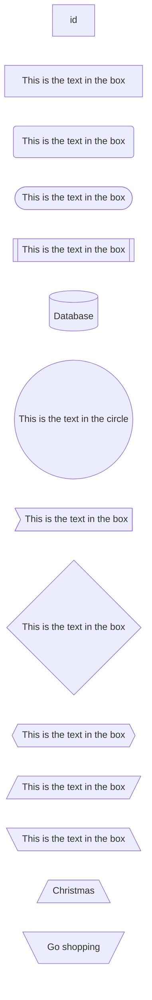
* 连接线
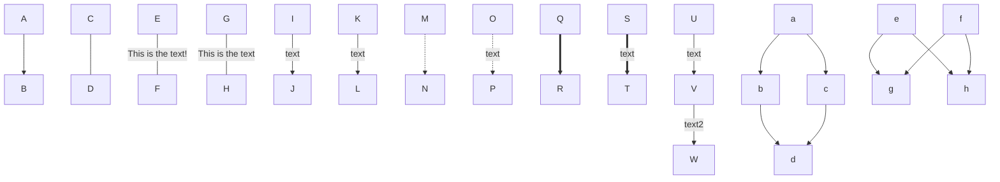
* subgraphs
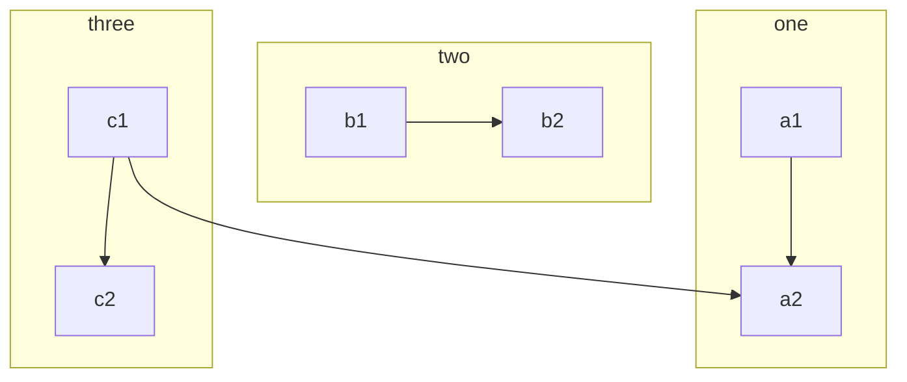
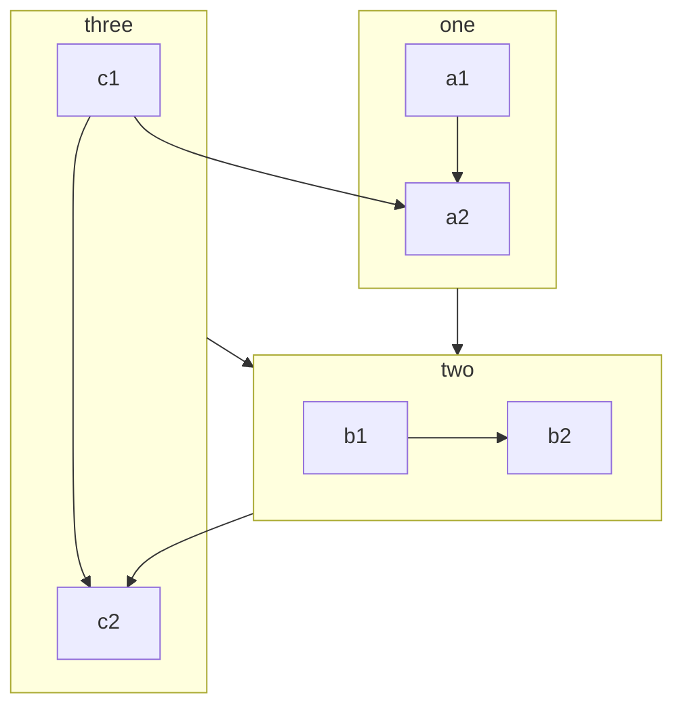

#### 时序图
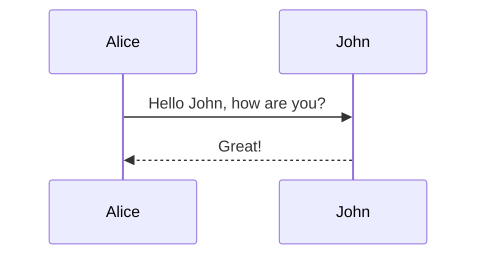
* participants
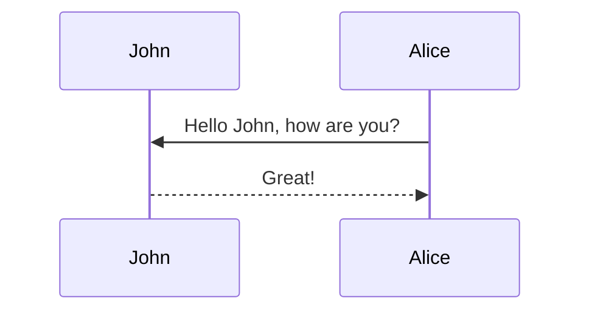
* Aliases
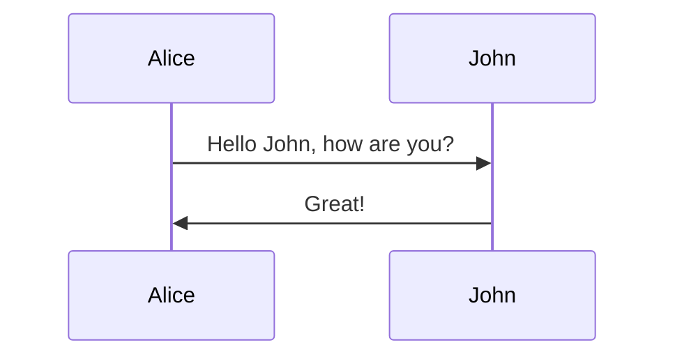
* 连线

| Type |	Description |
| ---- | -------------- |
| ->   | Solid line without arrow  |
| -->  | Dotted line without arrow |
| ->>  | Solid line with arrowhead |
| -->> | Dotted line with arrowhead |
| -x   | Solid line with a cross at the end |
| --x  | Dotted line with a cross at the end. |

* Activations
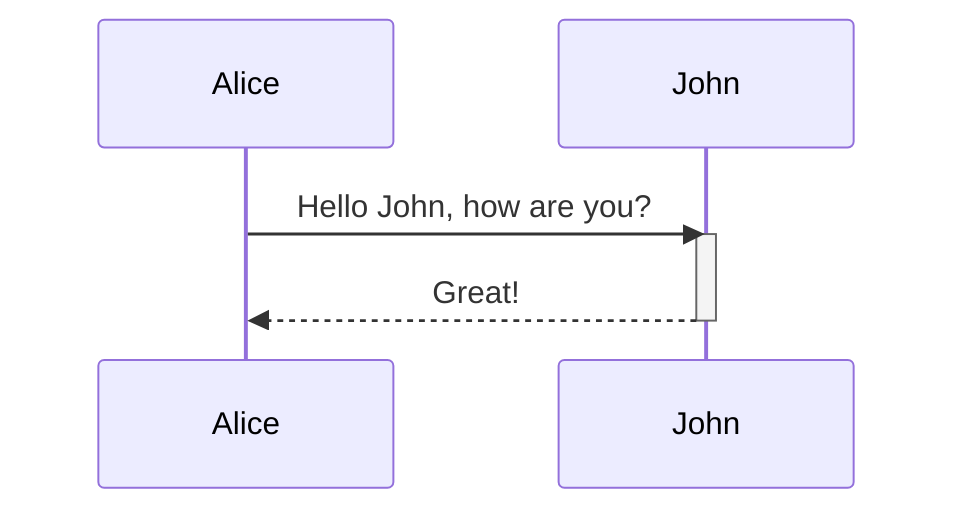
也可使用 +/-实现：
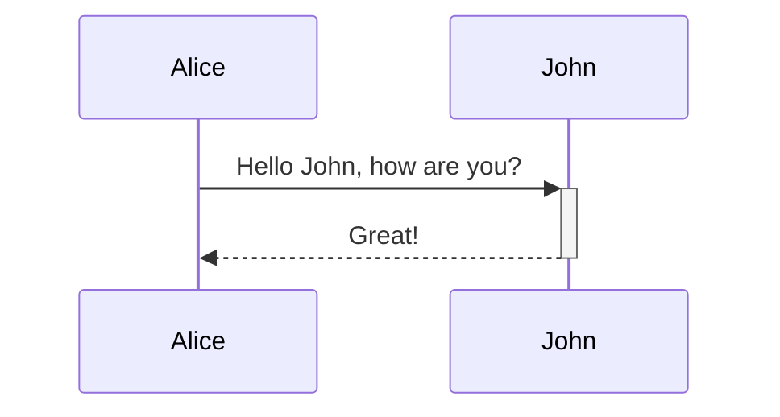
嵌套：
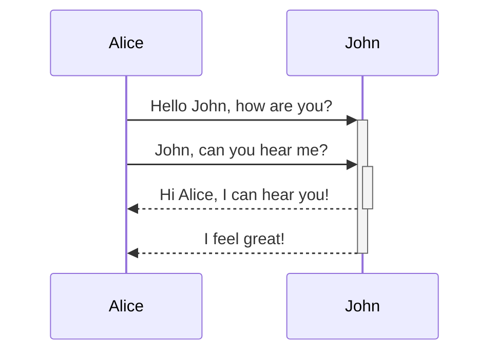
* Notes
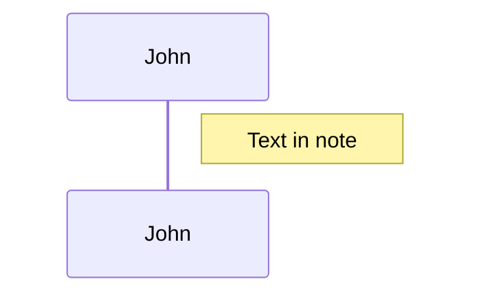
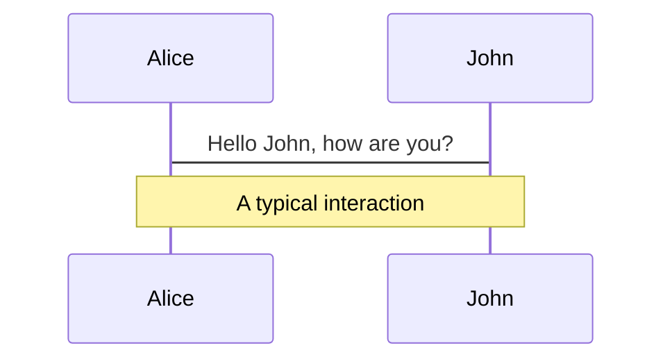
* Loops
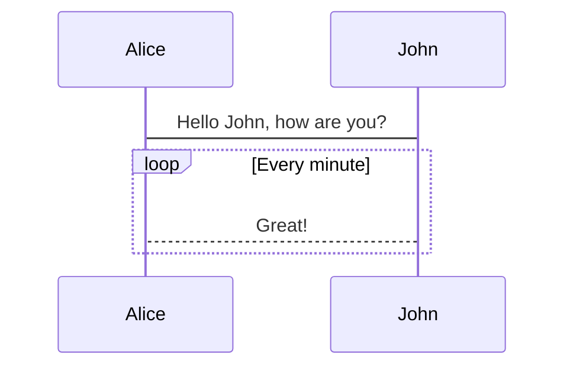
* Alt
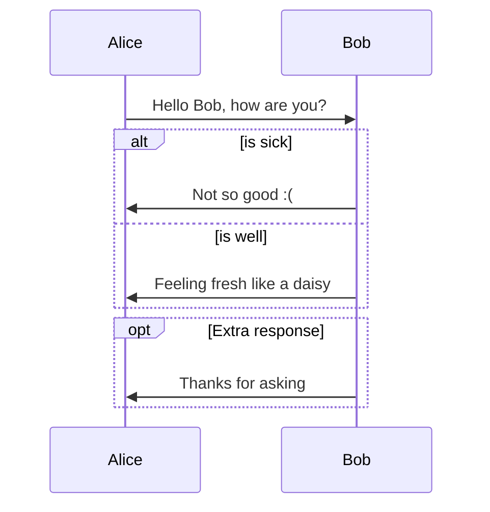
* Background Highlighting
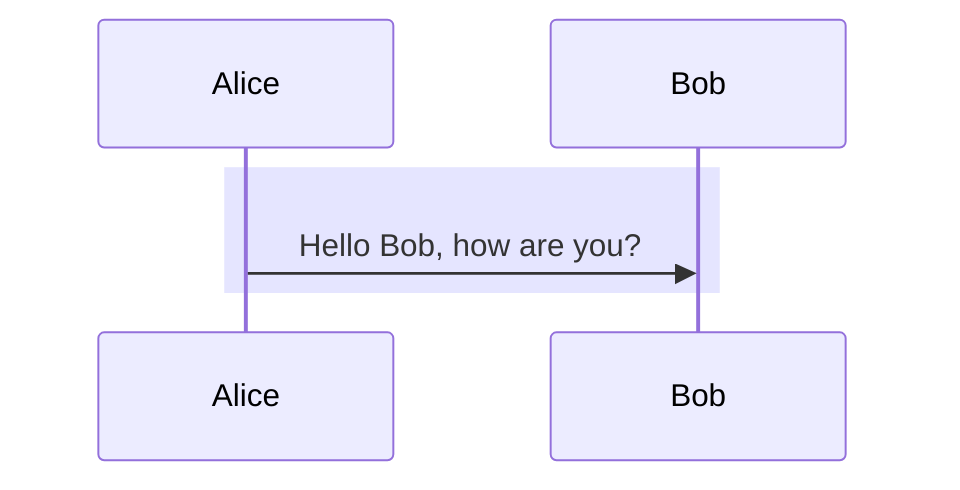

#### 类图
* 类的定义
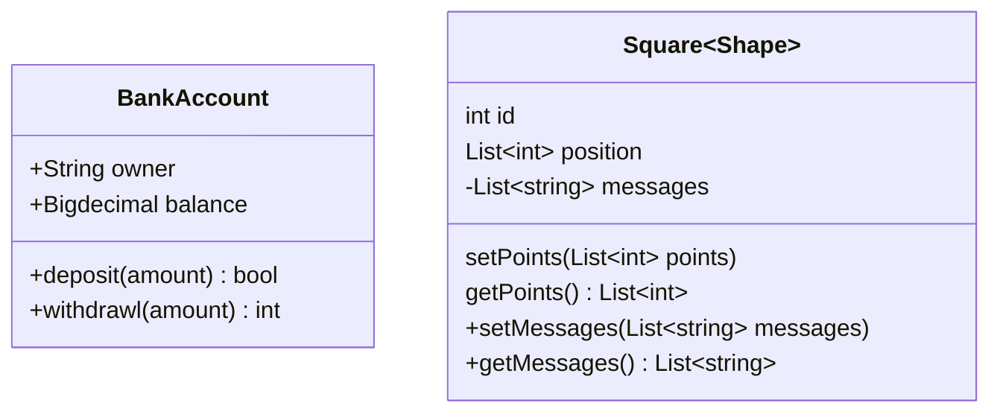
* 类之间的关系
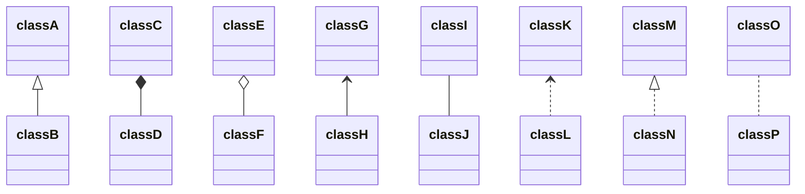
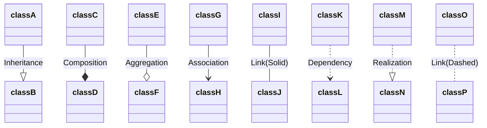

#### 状态图
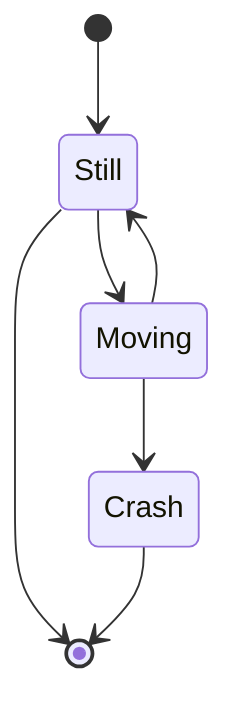
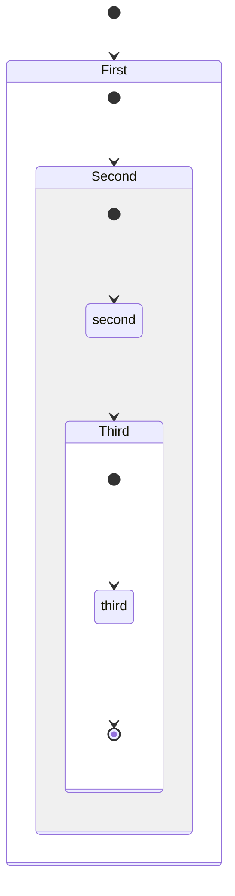
``` mermaid
stateDiagram-v2
    [*] --> First
    First --> Second
    First --> Third

    state First {
        [*] --> fir
        fir --> [*]
    }
    state Second {
        [*] --> sec
        sec --> [*]
    }
    state Third {
        [*] --> thi
        thi --> [*]
    }
```
* forks
``` mermaid
stateDiagram-v2
    state fork_state <<fork>>
      [*] --> fork_state
      fork_state --> State2
      fork_state --> State3

      state join_state <<join>>
      State2 --> join_state
      State3 --> join_state
      join_state --> State4
      State4 --> [*]
```
* notes
``` mermaid
stateDiagram-v2
    State1: The state with a note
    note right of State1
        Important information! You can write
        notes.
    end note
    State1 --> State2
    note left of State2 : This is the note to the left.
```
* Concurrency
``` mermaid
stateDiagram-v2
    [*] --> Active

    state Active {
        [*] --> NumLockOff
        NumLockOff --> NumLockOn : EvNumLockPressed
        NumLockOn --> NumLockOff : EvNumLockPressed
        --
        [*] --> CapsLockOff
        CapsLockOff --> CapsLockOn : EvCapsLockPressed
        CapsLockOn --> CapsLockOff : EvCapsLockPressed
        --
        [*] --> ScrollLockOff
        ScrollLockOff --> ScrollLockOn : EvScrollLockPressed
        ScrollLockOn --> ScrollLockOff : EvScrollLockPressed
    }
```

#### 甘特图
``` mermaid
gantt
    dateFormat  YYYY-MM-DD
    title       Adding GANTT diagram functionality to mermaid
    excludes    weekends
    %% (`excludes` accepts specific dates in YYYY-MM-DD format, days of the week ("sunday") or "weekends", but not the word "weekdays".)

    section A section
    Completed task            :done,    des1, 2014-01-06,2014-01-08
    Active task               :active,  des2, 2014-01-09, 3d
    Future task               :         des3, after des2, 5d
    Future task2              :         des4, after des3, 5d

    section Critical tasks
    Completed task in the critical line :crit, done, 2014-01-06,24h
    Implement parser and jison          :crit, done, after des1, 2d
    Create tests for parser             :crit, active, 3d
    Future task in critical line        :crit, 5d
    Create tests for renderer           :2d
    Add to mermaid                      :1d

    section Documentation
    Describe gantt syntax               :active, a1, after des1, 3d
    Add gantt diagram to demo page      :after a1  , 20h
    Add another diagram to demo page    :doc1, after a1  , 48h

    section Last section
    Describe gantt syntax               :after doc1, 3d
    Add gantt diagram to demo page      :20h
    Add another diagram to demo page    :48h
```

#### 饼分图
``` mermaid
pie
    title Key elements in Product X
    "Calcium" : 42.96
    "Potassium" : 50.05
    "Magnesium" : 10.01
    "Iron" :  5
```