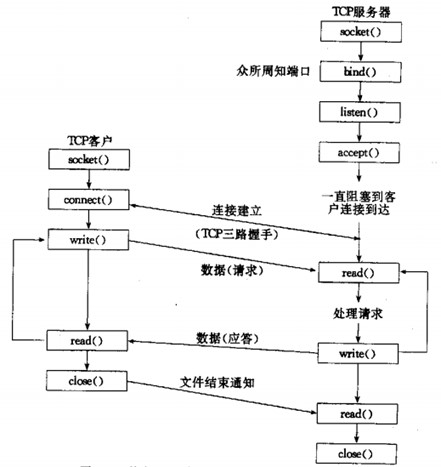
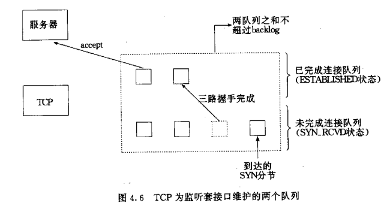
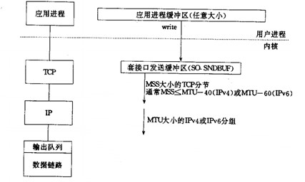

### socket基础
ipv4套接口地址结构和通用地址结构：**man 7 ip**
>* struct sockaddr_in
>* struct sockaddr

网络字节序和主机字节序
>* 大端：高位放低地址，低位放高地址
>* 小段：高位放高地址，低位放低地址
>* 网络字节规定为大端字节序，主机字节序有不同，x86为小端，Motorola 6800为大端字节序， ARM可配置
```C
// 测试本机字节序
#include <stdio.h>

int main(void) {
	int n = 0x12345678;
	char *p = &n;
	printf("%x %x %x %x\n", p[0], p[1], p[2], p[3]);
	
	if (p[0] == 0x78) {
		printf("the machine is little endian!\n");
	}
	else {
		printf("the machine is big endian!\n");
	}
	
	return 0;
}
```

本机和网络字节序转换：**man htohl**
```C
// 本地字节序和网络字节序的转换

#include <stdio.h>
#include <arpa/inet.h>
/*
uint32_t htonl(uint32_t hostlong);
uint16_t htons(uint16_t hostshort);
uint32_t ntohl(uint32_t netlong);
uint16_t ntohs(uint16_t netshort);
*/

int main(void) {
	int n = 0x12345678;
	char *p = &n;
	printf("%x %x %x %x\n", p[0], p[1], p[2], p[3]);
	
	if (p[0] == 0x78) {
		printf("the machine is little endian!\n");
	}
	else {
		printf("the machine is big endian!\n");
	}
	
	printf("convert host to net:\n");
	uint32_t netdata = htonl(n);
	p = &netdata;
	printf("%x %x %x %x\n", p[0], p[1], p[2], p[3]);
	if (p[0] == 0x78) {
		printf("net is little endian!\n");
	}
	else {
		printf("net is big endian!\n");
	}
	
	return 0;
	
}
```

地址转换函数：**man inet_aton/inet_addr**
>* 因为在tcp/ip协议里面 ipv4为32位的 =====》 192.168.6.222
```C
// 地址转换函数

#include <stdio.h>

#include <sys/socket.h>
#include <netinet/in.h>
#include <arpa/inet.h>
/*
       int inet_aton(const char *cp, struct in_addr *inp);
       in_addr_t inet_addr(const char *cp);
       in_addr_t inet_network(const char *cp);
       char *inet_ntoa(struct in_addr in);
       struct in_addr inet_makeaddr(int net, int host);
       in_addr_t inet_lnaof(struct in_addr in);
       in_addr_t inet_netof(struct in_addr in);
*/

int main(void) {
	in_addr_t myint =  inet_addr("192.168.2.222");
	printf("%u\n", myint);
	
	/* 
           struct in_addr {
               uint32_t       s_addr;     
           };
	*/
	struct in_addr myaddr;
	inet_aton("192.168.2.222", &myaddr);
	printf("%u\n", myaddr.s_addr);
	
	// 深刻理解为什么这个地方要求传入的是元素
	char *ipaddr = inet_ntoa(myaddr);
	printf("%s\n", ipaddr);
	
	return 0;
}
```
TCP客户服务器模型：



***
### Socket API基本实战
服务器端至少要两个套接字，一个用来接收客户端的连接，一个用来返回客户端的连接

**socket**函数：**man 2 socket**
> * 创建一个套接字用于通信

**bind**函数：
>* 服务器端使用
>* 绑定一个本地地址到套接字

**listen**函数：
>* 一般来说，listen函数应该在调用socket和bind函数之后，调用函数accept之前调用。
>* 对于给定的监听套接口，内核要维护两个队列：
    >* 已由客户发出并到达服务器，服务器正在等待完成相应的TCP三路握手过程
    >* 已完成连接的队列


  

**accept**函数：
>* 从已完成连接队列返回第一个连接，如果已完成连接队列为空，则阻塞

**connect**函数：
>* 客户端使用
>* 建立一个连接至addr所指定的套接字

一个Demo：
* 服务器端代码：
```C
#include <stdio.h>
#include <stdlib.h>
#include <error.h>
#include <unistd.h>

#include <sys/types.h>
#include <sys/socket.h>
#include <arpa/inet.h>
#include <netinet/in.h>

/*
        int socket(int domain, int type, int protocol);
	   
	    int bind(int sockfd, const struct sockaddr *addr,
                socklen_t addrlen);
	   
	    struct sockaddr {
               sa_family_t sa_family;
               char        sa_data[14];
           }
		
		// man 7 ip
		struct sockaddr_in {
               sa_family_t    sin_family; // address family: AF_INET 
               in_port_t      sin_port;   // port in network byte order 
               struct in_addr sin_addr;   // internet address 
           };

		struct in_addr {
		   uint32_t       s_addr;     // address in network byte order 
		};
		
		int listen(int sockfd, int backlog);
		int accept(int sockfd, struct sockaddr *addr, socklen_t *addrlen);
*/

int main(void) {
	int ret = 0;
	int conn = 0;
	int sockfd = 0; // 被动套接字描述符
	char revbuf[1024] = {0};
	sockfd = socket(AF_INET, SOCK_STREAM, 0);
	if (sockfd == -1) {
		perror("socket error!\n");
		exit(0);
	}
	
	struct sockaddr_in srvaddr;
	srvaddr.sin_family = AF_INET;
	srvaddr.sin_port = htons(8002);
	srvaddr.sin_addr.s_addr = inet_addr("127.0.0.1");
	ret = bind(sockfd, (struct sockaddr *)&srvaddr, sizeof(srvaddr));
	if (ret == -1) {
		perror("bind error!\n");
		exit(0);
	}
	
	// 一旦调用listen函数，这个套接字sockfd将变成被动套接字；只能接受连接，不能主动的发送连接
	// listen建立了两个队列，一个已完成三次握手的队列，一个正在三次握手的队列
	ret = listen(sockfd, SOMAXCONN);
	if (ret == -1) {
		perror("listen error!\n");
		exit(0);
	}
	
	printf("after listen\n");
	
	struct sockaddr_in peeraddr; // 
	socklen_t peerlen;
	// accept会返回一个新的连接描述符，以及对端的ip地址信息
	conn = accept(sockfd, (struct sockaddr*)&peeraddr, &peerlen);
	if (conn == -1) {
		perror("accept error!\n");
		exit(0);
	}
	printf("peer address: %s\n", inet_ntoa(peeraddr.sin_addr));
	printf("peer port: %d\n", ntohs(peeraddr.sin_port));
	
	while (1) {
		ret = read(conn, revbuf, sizeof(revbuf));
		if (ret == 0) {
			// 如果在读的过程中对方已经关闭，tcpip会返回一个0数据包
			printf("peer is closed.\n");
			exit(0);
		}
		else if (ret < 0) {
			perror("read error.\n");
			exit(0);
		}
		
		fputs(revbuf, stdout); // 服务器端打印数据
		ret = write(conn, revbuf, ret); // 服务器端发送数据
		if (ret < 0) {
			perror("write error.\n");
			exit(0);
		}
	}
	
	return 0;
}
```
* 客户端代码：
```C
#include <stdio.h>
#include <stdlib.h>
#include <error.h>
#include <unistd.h>
#include <string.h>

#include <sys/types.h>
#include <sys/socket.h>
#include <arpa/inet.h>
#include <netinet/in.h>

int main(void) {
	int ret = 0;
	int sockfd = 0;
	sockfd = socket(AF_INET, SOCK_STREAM, 0);
	if (sockfd == -1) {
		perror("socket error!\n");
		exit(0);
	}
	
	struct sockaddr_in srvaddr;
	srvaddr.sin_family = AF_INET;
	srvaddr.sin_port = htons(8002);
	srvaddr.sin_addr.s_addr = inet_addr("127.0.0.1");
	
	ret = connect(sockfd, (const struct sockaddr *)&srvaddr,
                   sizeof(srvaddr));
	if (ret == -1) {
		perror("connect error!\n");
		exit(0);
	}
	
	char revbuf[1024] = {0};
	char sendbuf[1024] = {0};
	
	while (fgets(sendbuf, sizeof(revbuf), stdin) != NULL) {
		// 向服务器写数据
		write(sockfd, sendbuf, strlen(sendbuf));
		// 从服务器读数据
		read(sockfd, revbuf, sizeof(revbuf));
		
		fputs(revbuf, stdout); // 打印收到的服务器数据
		
		memset(revbuf, 0, sizeof(revbuf));
		memset(revbuf, 0, sizeof(sendbuf));
	}

	
	return 0;
}
```

地址复用：
* 服务器端尽可能使用**SO_REUSEADDR**
* 在绑定之前尽可能使用**setsockopt**来设置SO_REUSEADDR套接字选项。
* 使用SO_REUSERADDR选项可以使得不必等待**TIME_WAIT**状态消失就可以重启服务器

Socket服务支持多并发（多客户端连接）
* 服务器不能支持多并发的原因是不能accept，在调用listen函数之后，linux内核在有客户端连接过来的时候会给你做好三次握手，放在listen创建的两个队列里面，之后accept才能从队列中拿到建立好的连接。
* 解决办法：服务器端 accept之后fork一个子进程进行和客户端的通信
```C
// 支持多并发服务器
#include <stdio.h>
#include <stdlib.h>
#include <error.h>
#include <unistd.h>
#include <sys/types.h>
#include <sys/socket.h>
#include <arpa/inet.h>
#include <netinet/in.h>
int main(void) {
	int ret = 0;
	int sockfd = 0; // 被动套接字描述符
	char revbuf[1024] = {0};
	sockfd = socket(AF_INET, SOCK_STREAM, 0);
	if (sockfd == -1) {
		perror("socket error!\n");
		exit(0);
	}
	
	struct sockaddr_in srvaddr;
	srvaddr.sin_family = AF_INET;
	srvaddr.sin_port = htons(8002);
	srvaddr.sin_addr.s_addr = inet_addr("127.0.0.1");
	ret = bind(sockfd, (struct sockaddr *)&srvaddr, sizeof(srvaddr));
	if (ret == -1) {
		perror("bind error!\n");
		exit(0);
	}
	
	// 设置地址复用
	int optval = 1;
	if (setsockopt(sockfd, SOL_SOCKET, SO_REUSEADDR,
                      &optval, sizeof(optval)) < 0) {
		perror("getsockopt error!\n");
		exit(0);
	}
	
	// 一旦调用listen函数，这个套接字sockfd将变成被动套接字；只能接受连接，不能主动的发送连接
	// listen建立了两个队列，一个已完成三次握手的队列，一个正在三次握手的队列
	ret = listen(sockfd, SOMAXCONN);
	if (ret == -1) {
		perror("listen error!\n");
		exit(0);
	}
	
	printf("after listen\n");
	
	while (1) {
		int conn = 0;
		struct sockaddr_in peeraddr; // 
		socklen_t peerlen;
		// accept会返回一个新的连接描述符，以及对端的ip地址信息
                // 没有客户端连接的时候，会阻塞在这里
		conn = accept(sockfd, (struct sockaddr*)&peeraddr, &peerlen);
		if (conn == -1) {
			perror("accept error!\n");
			exit(0);
		}
		printf("peer address: %s\n", inet_ntoa(peeraddr.sin_addr));
		printf("peer port: %d\n", ntohs(peeraddr.sin_port));
		
		pid_t pid = fork();
		
		if (pid == 0) {// child
			close(sockfd);
			while (1) {
				ret = read(conn, revbuf, sizeof(revbuf));
				if (ret == 0) {
					// 如果在读的过程中对方已经关闭，tcpip会返回一个0数据包
					printf("peer is closed.\n");
                                        close(conn);
					exit(0);
				}
				else if (ret < 0) {
					perror("read error.\n");
					exit(0);
				}
				
				fputs(revbuf, stdout); // 服务器端打印数据
				ret = write(conn, revbuf, ret); // 服务器端发送数据
				if (ret < 0) {
					perror("write error.\n");
					exit(0);
				}
			}
			exit(0);
		}
		else if (pid > 0) { // parent
			close(conn);
		}
		else {
			close(conn);
			close(sockfd);
			printf("fork failsed!\n");
		}
		
	}	
	return 0;
}
```

**长链接和短链接**：
* 长链接：客户端链接之后就不断开了， 上面这个程序就是长链接
* 短链接：客户端每做一次链接之后断掉，下一次通信重新链接。。长链接改成短链接就改改client就好了

**流协议和粘包**：
* 假设主机A send了两条消息M1和M2 各10k 给主机B，由于主机B一次提取的字节数是不确定的，接收方提取数据的情况可能是：
    - 一次性提取20k 数据
    - 分两次提取，第一次5k，第二次15k
    - 分两次提取，第一次15k，第二次5k
    - 分两次提取，第一次10k，第二次10k
    - 分三次提取，第一次6k，第二次8k，第三次6k
    - 其他任何可能
* 粘包产生的原因：
    - tcp   字节流 无边界 udp  消息、数据报 有边界
    - 对等方，一次读操作，不能保证完全把消息读完。
    - 对方接受数据包的个数是不确定的。
    - 
* 产生粘包问题的原因
    1. SQ_SNDBUF 套接字本身有缓冲区 （发送缓冲区、接受缓冲区）
    2. tcp传送的端 mss大小限制
    3. 链路层也有MTU大小限制，如果数据包大于>MTU要在IP层进行分片，导致消息分割。
    4. tcp的流量控制和拥塞控制，也可能导致粘包
    5. tcp延迟发送机制 等等

结论：tcp/ip协议，在传输层没有处理粘包问题。    
* 粘包问题主要还是因为接收方不知道消息之间的界限，不知道一次性提取多少字节的数据所造成的。
* 解决办法：本质上是要在应用层维护消息与消息的边界
    - 定长包
    - 包尾加\r\n（ftp）
    - 包头加上包体长度
    - 更复杂的应用层协议
```C
ssize_t readn(int fd, void *buf, size_t count)
{
        size_t nleft = count;
        ssize_t nread;
        char *bufp = (char*)buf;

        while (nleft > 0)
        {
                if ((nread = read(fd, bufp, nleft)) < 0)
                {
                        if (errno == EINTR)
                                continue;
                        return -1;
                }
                else if (nread == 0)
                        return count - nleft;

                bufp += nread;
                nleft -= nread;
        }

        return count;
}

ssize_t writen(int fd, const void *buf, size_t count)
{
        size_t nleft = count;
        ssize_t nwritten;
        char *bufp = (char*)buf;

        while (nleft > 0)
        {
            if ((nwritten = write(fd, bufp, nleft)) < 0)
            {
                    if (errno == EINTR)
                            continue;
                    return -1;
            }
            else if (nwritten == 0)
                    continue;

            bufp += nwritten;
            nleft -= nwritten;
        }

        return count;
}

//从指定的socket中读取指定大小的数据但 不取出，封装后不被信号中断
ssize_t recv_peek(int sockfd, void *buf, size_t len)
{
	while (1)
	{
		//MSG_PEEK 读取队列中指定大小的数据，但不取出
		int ret = recv(sockfd, buf, len, MSG_PEEK);
		//如果被信号中断，则继续
		if (ret == -1 && errno == EINTR)
			continue;
		return ret;
	}
}

//maxline 一行最大数
//先提前peek一下缓冲区，如果有数据从缓冲区的读数据，
//1、缓冲区数据中带\n
//2 缓存区中不带\n
//读取读取包直到\n
ssize_t readline(int sockfd, void *buf, size_t maxline)
{
	int ret;
	int nread;//成功预读取的数据的个数
	char *bufp = buf;//读取数据存放的数组，在外分配内存
	int nleft = maxline;//封包最大值
	while (1)
	{
		//看一下缓冲区有没有数据，并不移除内核缓冲区数据
		ret = recv_peek(sockfd, bufp, nleft);
		if (ret < 0) //失败 
			return ret;
		else if (ret == 0) //对方已关闭
			return ret;

		nread = ret;
		int i;
		for (i = 0; i < nread; i++)
		{
			if (bufp[i] == '\n') //若缓冲区有\n
			{
				ret = readn(sockfd, bufp, i + 1); //读走数据
				if (ret != i + 1)
					exit(EXIT_FAILURE);
				return ret; //有\n就返回，并返回读走的数据
			}
		}

		if (nread > nleft) //如果读到的数大于 一行最大数 异常处理
			exit(EXIT_FAILURE);

		nleft -= nread;  ////若缓冲区没有\n, 把剩余的数据读走
		ret = readn(sockfd, bufp, nread);
		if (ret != nread)
			exit(EXIT_FAILURE);
		bufp += nread; //bufp指针后移后，再接着偷看缓冲区数据recv_peek，直到遇到\n
	}

	return -1;
}
```

获取本机ip和对端ip：**getsockname、getpeername**，注意是已连接后的套接字


