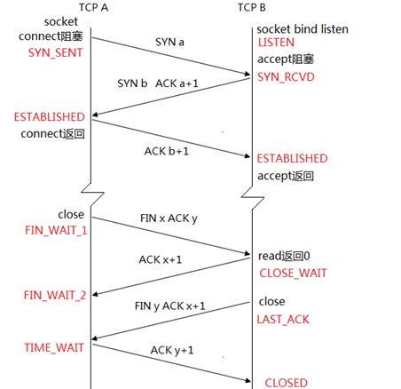
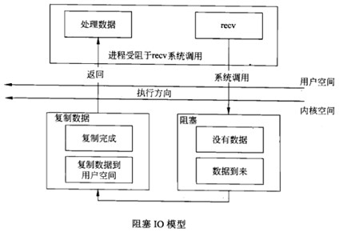
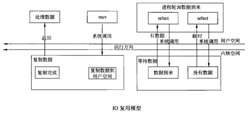
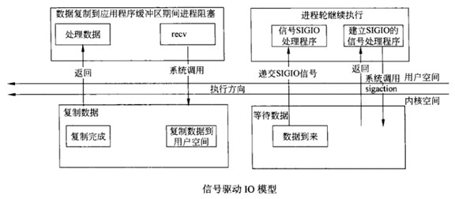
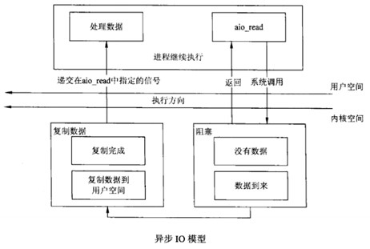

## 服务器端多进程并发问题
### 让服务器端支持多并发
* 服务器端在调用*listen*函数以后要支持多进程并发接受连接，内核会帮你维护两个队列，一个正在连接的队列和一个已经连接的队列，那么只有调用*accept*函数，才能从已连接的队列中拿到一个连接来和客户端进行通信。
* 所以服务器端要支持多并发，则需要写一个循环调用*accept*，已连接队列为空的话就会阻塞在这个地方，当有客户端连接的时候，会得到一个连接的socket。
* 调用*accept*后fork一个子进程，在子进程里(close(listenfd))和客户端进行通信，父进程里直接close(conn)。

### 僵尸进程的问题
* 按照上述的方法支持多并发以后，如果客户端关闭了连接，服务器端会接受到一个FIN，判断之后让子进程死掉（exit），这个时候父进程如果没有处理的话就会产生僵尸进程。
* 解决办法：注册一个信号，子进程在exit之前给父进程发送一个信号（kill），让父进程给收尸
    - signal(SIGCHLD, SIG_IGN);
    - signal(SIGCHLD, myhandler); 在myhandler调用wait或者waitpid进行处理。

### 多个子进程同时断开连接的问题
* 按照上面解决僵尸进程的方法进行处理，问题又出现了，假设有多个子进程同时关闭了连接，这个时候父进程会接受到多个SIGCHLD信号，而SIGCHLD是**不可靠信号**，后到来的信号被丢失了，同样产生了僵尸进程
* 特别注意的问题，如果每个连接产生一个僵尸进程，这样你的服务器用不了多久就挂了。
* 解决办法：
``` C
void myhandler(int sig) {
    // wait(NULL); // 现在用wait不管用了
    int mypid = 0;
    while ( (mypid = waitpid(-1, NULL, WNOHANG)) > 0  ) {
        ;
    }
}
int main(void) {
    ...
    signal(SIGCHLD, myhandler);
    ...
}
```
---

## TCP/IP的11种状态



### 十一种状态：
* SYN_SENT: 客户端发送SYN之后
* LISTEN： 服务器端调用*listen*后
* SYN_RCVD：服务器接收到客户端发来的SYN之后，给客户端发送SYN和ACK
* ENSTABLISHED：客户端收到ACK之后，和服务器端收到ACK之后
* FIN_WAIT_1：close的一端发送FIN之后
* CLOSE_WAIT：另一端接收到FIN之后（read返回0）
* FIN_WAIT2：主动close的一端接收到ACK
* LAST_ACK：后关闭的一端发送FIN之后
* TIME_WAIT：主动关闭的一方收到后关闭的一方发来FIN之后
* CLOSED：被动关闭的一方收到最后的确认ACK之后
* 除了图上的几种状态之外，还有一种CLOSING状态，两端同时关闭，将产生closing状态，最后双方都进入TIME_WAIT状态

### SIGPIPE
如果对方socket已关闭，对等方再发送数据，则会产生SIGPIPE信号：
* SIGPIPE信号会让进程终止，（man 7 signal，查看SIGPIPE默认ACT）
* 往一个已经接收FIN的套接字中写是允许的，接收到FIN仅仅代表对方不再发送数据。
* 在收到RST段之后，如果再调用write就会产生SIGPIPE信号，对于这个信号的处理，我们通常忽略即可

### TCP/IP的RST段重置
* 服务器端启动，客户端启动
* 服务器端先kill与客户端通讯的子进程，服务器端会给客户端发送FIN，此时：只代表服务器端不发送数据了，不代表客户端不能往套接字中写数据
* 如果子进程此时写数据给服务器：将要导致TCP/IP协议重置，产生RST段，产生SIGPIPE信号。。
* 所以一般情况下，需要我们处理SIGPIPE信号，忽略即可。

### close与shutdown的区别
* close终止了数据传送的两个方向。
* shutdown可以有选择的终止某个方向的数据传送或者终止数据传送的两个方向
* shutdown 可以保证对方接收到FIN，而不管其他进程是否打开了套接字。而close不能保证，直到套接字引用计数减为0时才发送，也就是说直到所有的进程都关闭了套接字。
* 考虑这个场景：服务器端在accept一个连接之后fork一个子进程来和客户端进行通讯，这个时候相当于有两个述符指向了这个套接字，套接字的**引用计数**为2，如果在父进程中不close得话，那么客户端发送FIN来了之后，服务器端做处理在子进程中调用了close，这个时候服务器端并不会向客户端发FIN报文。所以这个时候shutdown就派上用场了。

---

## 多并发服务器开发总结-基本功
* TCP/IP 11种状态
* 父进程处理并发子进程，不能产生僵尸进程
    - SIGCHLD   
    - while(waitpid(-1, NULL, WNOHANG) != >0)
* SIGPIPE: 忽略它
* close(conn) shutdown()...
* 长连接短连接

---

## 五种I/O模型
### 阻塞IO

* 当上层应用app1调用recv系统调用时，如果对方没有发送数据（缓冲区没有数据），上层应用app1将阻塞（默认行为，被linux内核阻塞）
* 当对等方发送了数据，linux内核recv端缓冲区，有数据后，内核会把数据copy给用户空间，然后上层应用app1解除阻塞，执行下一步操作。

### 非阻塞IO
* 上层应用程序app2将套接字设置成非阻塞模式。
* 上层应用程序app2轮询调用recv函数，接受数据。若缓冲区没有数据，上层程序app2不会阻塞，recv返回值为-1，错误码是EWOULDBLOCK。
* 上层应用程序不断轮询有没有数据到来。会造成上层应用忙等待。大量消耗CPU。很少直接用。应用范围小，一般和selectIO复用配合使用。

### IO复用模型

* 说明1： 上层应用程序app3调用select机制（该机制有linux内核支持，避免了app3忙等待。），进行轮询文件描述符的状态变化。
* 说明2：当select管理的文件描述符没有数据（或者状态没有变化时），上层应用程序app3也会阻塞。
* 说明3：好处select机制可以管理多个文件描述符
* 说明4：select可以看成一个管理者，用select来管理多个IO。
    - 一旦检测到的一个I/O或者多个IO，有我们感兴事件，发生，select函数将返回，返回值为检测到的事件个数。进而可以利用select相关api函数，操作具体事件。
* 说明5：select函数可以设置等待时间，避免了上层应用程序app3，长期僵死。
* 说明6: 和阻塞IO模型相比，selectI/O复用模型相当于提前阻塞了。等到有数据到来时，再调用recv就不会发生阻塞。

### 信号驱动IO模型

* 说明1： 上层应用程序app4建立SIGIO信号处理程序。当缓冲区有数据到来，内核会发送信号告诉上层应用程序app4。
* 说明2：上层应用程序app4接收到信号后，调用recv函数，因缓冲区有数据，recv函数一般不会阻塞。
* 说明3：这种用于模型用的比较少，属于典型的“拉模式”。即：上层应用app4,需要调用recv函数把数据拉进来。    

### 异步IO

* 说明1：上层应用程序app5调用aio_read函数，同时提交一个应用层的缓冲区buf；调用完毕后，不会阻塞。上层应用程序app5可以继续其他任务。
* 说明2：当tcpip协议缓冲区有数据时，linux主动的把内核数据copy到用户空间。然后再给上层应用app5发送信号；告诉app5数据有了，赶快处理吧！
* 说明3：典型的“推模式”
* 说明4： 效率最高的一种形式，上层应用程序app5有异步处理的能力（在linux内核的支持下，言外之意：处理其他任务的同时，也可支持IO通讯）。异步I/O指的是什么？
* 上层应用程序app5，在也可以干别的活的时，可以接收数据（接受异步通信事件。===）异步命令来源）。与信号驱动IO模型，上层应用程序app5不需要调用recv函数。    

---

## I/O复用模型
* 指定非阻塞方式：
    - 打开时指定**O_NONBLOCK**状态
    - 使用**fcntl**打开或关闭非阻塞方式
* 多路IO：
    - 当程序需要同时从两个输入读数据时
    - 使用多进程/多线程，同步复杂，进程线程开销
    - 使用非阻塞IO，交替轮训
    - 通过信号使用异步IO，无法判断哪个IO完成
    - 多路IO：把关心的IO放入一个列表，调用多路函数
    - 多路IO函数阻塞，直到有一个IO数据准备好后返回
    - 返回后告诉调用者哪个描述符准备好了
* selece() 实现说明：
    - 调用select时通过参数告诉内核用户感兴趣的IO描述符
    - 关心的IO状态：输入，输出或错误
    - 调用者等待时间
    - 返回之后内核告诉调用者多个描述符准备好了
    - 那些描述符发生了变化
    - 调用返回后对准备好的描述符调用读写操作
    - 不关心的描述符集合传NULL
* select() 函数接口说明：
    - 如果成功，返回所有sets中描述符的个数；如果超时，返回0；如果出错，返回-1
    - 如果有了状态改变，会将其他fd清零，只有那些发生改变了的fd保持置位，以用来指示set中的哪一个改变了状态
    - 参数n是所有set里所有fd里，具有最大值的那个fd的值加1
    - fd_set:
        - FD_CLR(int fd, fd_set *set);FD_SET和FD_CLR用来对某个set添加和删除一个fd
        - FD_ISSET(int fd, fd_set *set);FD_ISSET用来指示一个fd是不是一个set的一部分。他很有用，用来看select后哪一个fd可用了

        - FD_SET(int fd, fd_set *set);

        - FD_ZERO(fd_set *set); FD_ZERO用来清空set
    - time_out
        - timeout是从调用开始到select返回前，会经历的最大等待时间
        - 两种特殊情况：如果为值为0，会立刻返回
        - 如果timeout是NULL,会阻塞式等待
``` C++
#include <sys/time.h>

#include <sys/types.h>

#include <unistd.h>   

int select(int n, fd_set *readfds, fd_set *writefds, fd_set *exceptfds,struct timeval *timeout);    
struct timeval {

                     long        tv_sec;   /* seconds */

                     long        tv_usec;         /* microseconds */

            };
```

### 套接字IO超时设置方法
* select实现超时：
    - read_timeout函数封装
    - write_timeout函数封装
    - accept_timeout函数封装
    - connect_timeout函数封装
```C++
/**
 * read_timeout - 读超时检测函数，不含读操作
 * @fd: 文件描述符
 * @wait_seconds: 等待超时秒数，如果为0表示不检测超时
 * 成功（未超时）返回0，失败返回-1，超时返回-1并且errno = ETIMEDOUT
 */
int read_timeout(int fd, unsigned int wait_seconds)
{
	int ret = 0;
	if (wait_seconds > 0)
	{
		fd_set read_fdset;
		struct timeval timeout;

		FD_ZERO(&read_fdset);
		FD_SET(fd, &read_fdset);

		timeout.tv_sec = wait_seconds;
		timeout.tv_usec = 0;
		
		//select返回值三态
		//1 若timeout时间到（超时），没有检测到读事件 ret返回=0
		//2 若ret返回<0 &&  errno == EINTR 说明select的过程中被别的信号中断（可中断睡眠原理）
		//2-1 若返回-1，select出错
		//3 若ret返回值>0 表示有read事件发生，返回事件发生的个数
		
		do
		{
			ret = select(fd + 1, &read_fdset, NULL, NULL, &timeout);
		} while (ret < 0 && errno == EINTR);

		if (ret == 0)
		{
			ret = -1;
			errno = ETIMEDOUT;
		}
		else if (ret == 1)
			ret = 0;
	}

	return ret;
}

/**
 * write_timeout - 写超时检测函数，不含写操作
 * @fd: 文件描述符
 * @wait_seconds: 等待超时秒数，如果为0表示不检测超时
 * 成功（未超时）返回0，失败返回-1，超时返回-1并且errno = ETIMEDOUT
 */
int write_timeout(int fd, unsigned int wait_seconds)
{
	int ret = 0;
	if (wait_seconds > 0)
	{
		fd_set write_fdset;
		struct timeval timeout;

		FD_ZERO(&write_fdset);
		FD_SET(fd, &write_fdset);

		timeout.tv_sec = wait_seconds;
		timeout.tv_usec = 0;
		do
		{
			ret = select(fd + 1, NULL, &write_fdset, NULL, &timeout);
		} while (ret < 0 && errno == EINTR);

		if (ret == 0)
		{
			ret = -1;
			errno = ETIMEDOUT;
		}
		else if (ret == 1)
			ret = 0;
	}

	return ret;
}

/**
 * accept_timeout - 带超时的accept
 * @fd: 套接字
 * @addr: 输出参数，返回对方地址
 * @wait_seconds: 等待超时秒数，如果为0表示正常模式
 * 成功（未超时）返回已连接套接字，超时返回-1并且errno = ETIMEDOUT
 */
int accept_timeout(int fd, struct sockaddr_in *addr, unsigned int wait_seconds)
{
	int ret;
	socklen_t addrlen = sizeof(struct sockaddr_in);

	if (wait_seconds > 0)
	{
		fd_set accept_fdset;
		struct timeval timeout;
		FD_ZERO(&accept_fdset);
		FD_SET(fd, &accept_fdset);
		timeout.tv_sec = wait_seconds;
		timeout.tv_usec = 0;
		do
		{
			ret = select(fd + 1, &accept_fdset, NULL, NULL, &timeout);
		} while (ret < 0 && errno == EINTR);
		if (ret == -1)
			return -1;
		else if (ret == 0)
		{
			errno = ETIMEDOUT;
			return -1;
		}
	}

	//一但检测出 有select事件发生，表示对等方完成了三次握手，客户端有新连接建立
	//此时再调用accept将不会堵塞
	if (addr != NULL)
		ret = accept(fd, (struct sockaddr*)addr, &addrlen); //返回已连接套接字
	else
		ret = accept(fd, NULL, NULL);
	if (ret == -1)
		ERR_EXIT("accept");

	return ret;
}

/**
 * activate_noblock - 设置I/O为非阻塞模式
 * @fd: 文件描符符
 */
void activate_nonblock(int fd)
{
	int ret;
	int flags = fcntl(fd, F_GETFL);
	if (flags == -1)
		ERR_EXIT("fcntl");

	flags |= O_NONBLOCK;
	ret = fcntl(fd, F_SETFL, flags);
	if (ret == -1)
		ERR_EXIT("fcntl");
}

/**
 * deactivate_nonblock - 设置I/O为阻塞模式 
 * @fd: 文件描符符
 */
void deactivate_nonblock(int fd)
{
	int ret;
	int flags = fcntl(fd, F_GETFL);
	if (flags == -1)
		ERR_EXIT("fcntl");

	flags &= ~O_NONBLOCK;
	ret = fcntl(fd, F_SETFL, flags);
	if (ret == -1)
		ERR_EXIT("fcntl");
}


/**
 * connect_timeout - connect
 * @fd: 套接字
 * @addr: 要连接的对方地址
 * @wait_seconds: 等待超时秒数，如果为0表示正常模式
 * 成功（未超时）返回0，失败返回-1，超时返回-1并且errno = ETIMEDOUT
 */
int connect_timeout(int fd, struct sockaddr_in *addr, unsigned int wait_seconds)
{
	int ret;
	socklen_t addrlen = sizeof(struct sockaddr_in);

	if (wait_seconds > 0)
		activate_nonblock(fd);

	ret = connect(fd, (struct sockaddr*)addr, addrlen);
	if (ret < 0 && errno == EINPROGRESS)
	{
		//printf("11111111111111111111\n");
		fd_set connect_fdset;
		struct timeval timeout;
		FD_ZERO(&connect_fdset);
		FD_SET(fd, &connect_fdset);
		timeout.tv_sec = wait_seconds;
		timeout.tv_usec = 0;
		do
		{
			// 一但连接建立，则套接字就可写  所以connect_fdset放在了写集合中
			ret = select(fd + 1, NULL, &connect_fdset, NULL, &timeout);
		} while (ret < 0 && errno == EINTR);
		if (ret == 0)
		{
			ret = -1;
			errno = ETIMEDOUT;
		}
		else if (ret < 0)
			return -1;
		else if (ret == 1)
		{
			//printf("22222222222222222\n");
			/* ret返回为1（表示套接字可写），可能有两种情况，一种是连接建立成功，一种是套接字产生错误，*/
			/* 此时错误信息不会保存至errno变量中，因此，需要调用getsockopt来获取。 */
			int err;
			socklen_t socklen = sizeof(err);
			int sockoptret = getsockopt(fd, SOL_SOCKET, SO_ERROR, &err, &socklen);
			if (sockoptret == -1)
			{
				
				return -1;
			}
			if (err == 0)
			{
				//printf("3333333333333\n");
				ret = 0;
			}
			else
			{
				//printf("4444444444444444:%d\n", err);
				errno = err;
				ret = -1;
			}
		}
	}
	if (wait_seconds > 0)
	{
		deactivate_nonblock(fd);
	}
	return ret;
}
```
* select 三个应用场景
    - 用select封装超时（connect、accept、read、write）
    - 用select优化客户端（stdin、confd）
    - 用select优化服务器（用一个单进程去支持多客户端）
        - select是一个管理机制，管理了多个IO，单进程用轮询的方式去检索n个IO是否发生变化

* socket性能：
    - 每一个进程的最大连接数 1024 ulimit - n （可以root修改2048）
    - select是一个管理机制管理的I/O 管理的文件描述符的集合。。FD_MAX 1024；
    - poll epoll
    - select 和 poll是拉模式，epoll是推模式

---

## 要点回顾
* 首先实现最简单的socket客户端和服务器端，实现基本的客户端给服务器发什么内容，服务器端就回复什么内容，使用到下面几个基础函数：
    - 服务器端：
        - socket
        - bind
        - setsockopt：setsockopt(listenfd, SOL_SOCKET, SO_REUSEADDR, &on, sizeof(on))
        - listen
        - accept
        - read，write
        - close
    - 客户端：
        - socket
        - connect
        - read， write
        - close
* 这个时候提出两个需求
    - 实现p2p聊天：
        - 客户端：在connect之后fork一个子进程，父进程和子进程一个负责收消息，一个负责发消息
        - 服务器端：在accept一个连接之后，fork一个子进程，父进程和子进程一个负责收消息，一个负责发消息
        - 这个时候需要注意不要产生孤儿进程和僵尸进程，这个时候需要注册信号来实现
        - 注意在父子进程中关闭不必要的socket描述符，close采用引用计数的方式
    - 让服务器端支持多客户端连接：
        - fork子进程的方式
        - select IO复用（或者叫做多路IO）
* fork子进程的方式实现多客户端连接：
    - 循环的调用accept函数，获取一个conn之后fork一个子进程和客户端进行通信
    - 注意子进程一般会比父进程先结束，要处理SIGCHLD信号
    - 处理SIGCHLD的时候注意多个客户端同时关闭的场景
        - while ( (pid = waitpid(0, NULL, WNOHANG)) > 0)；
    - 处理SIGPIPE:如果对方socket已关闭，对等方再发写数据，则会产生SIGPIPE信号，默认动作为terminal
* 处理粘包问题：
    - readn, writen
    - 定长包
    - 包尾加上\r\n （ftp）:recv_peek（recv(sockfd, buf, len, MSG_PEEK)）, readline
    - 包头加上包体长度
    - 更复杂的应用层协议
* select的三种场景：
    - 用select封装超时（connect、accept、read、write），注意connect，socket默认阻塞模式，需要设置为非阻塞，再调用connect和select
    - 用select优化客户端（有fileno(stdin)和sockd两个描述符）
    - 服务器端（服务器端有一个listenfd和若干个connfd）
